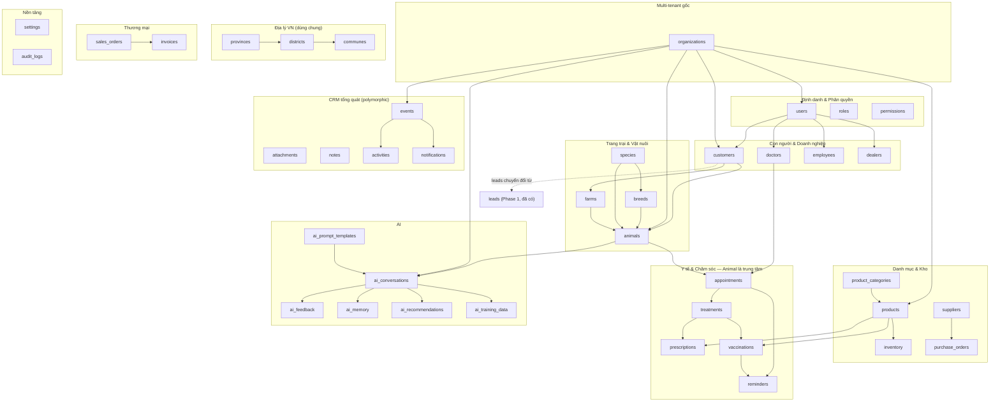
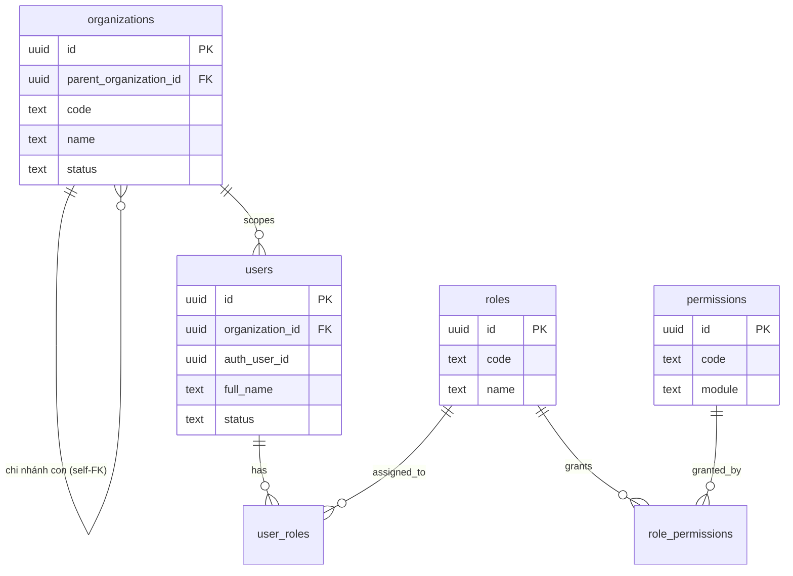
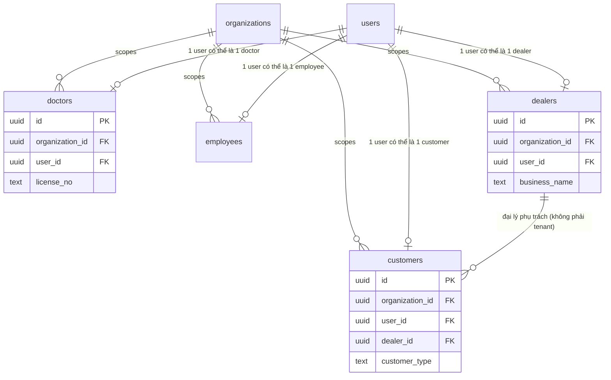
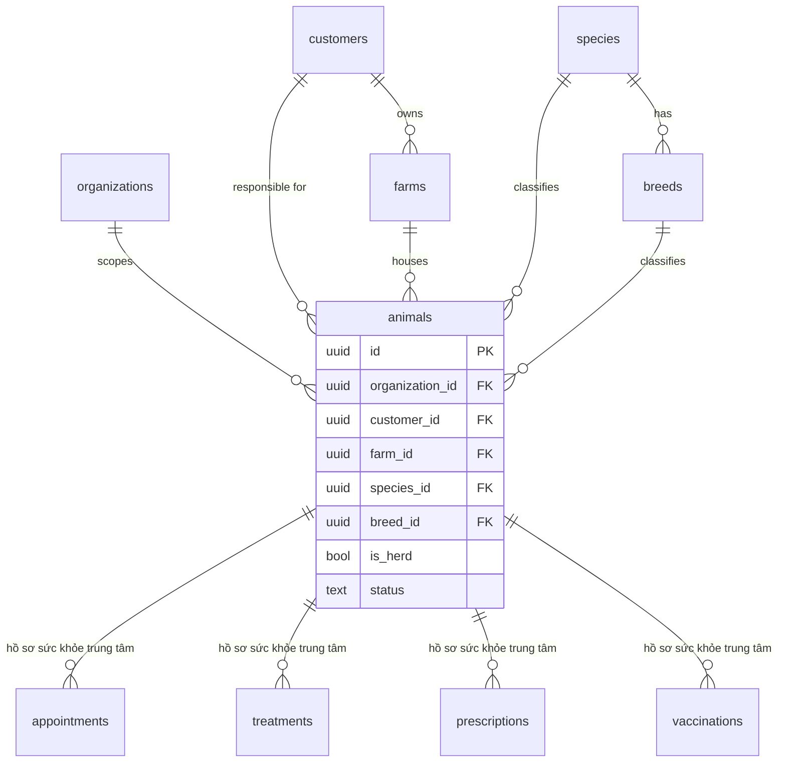
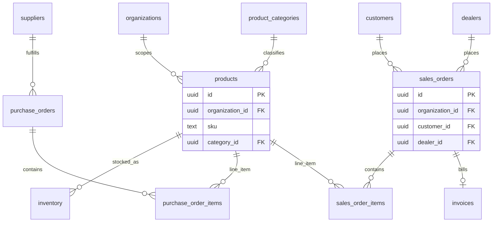
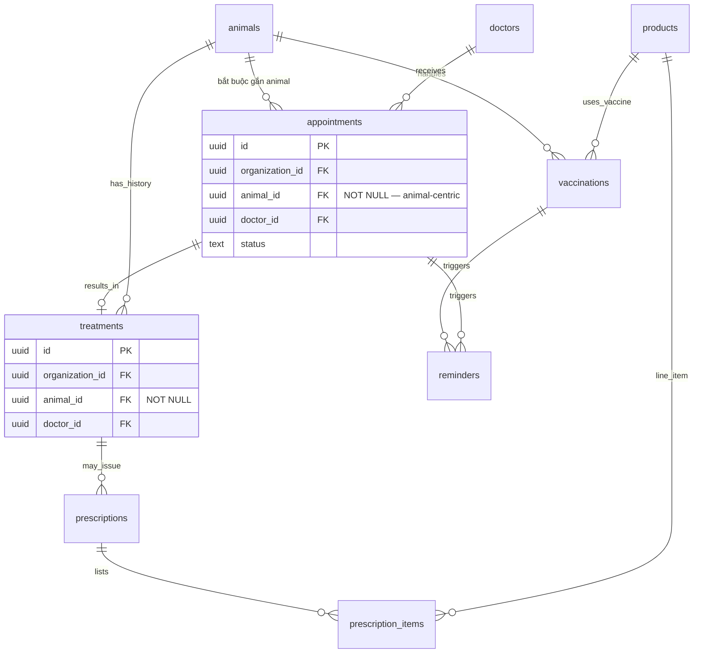
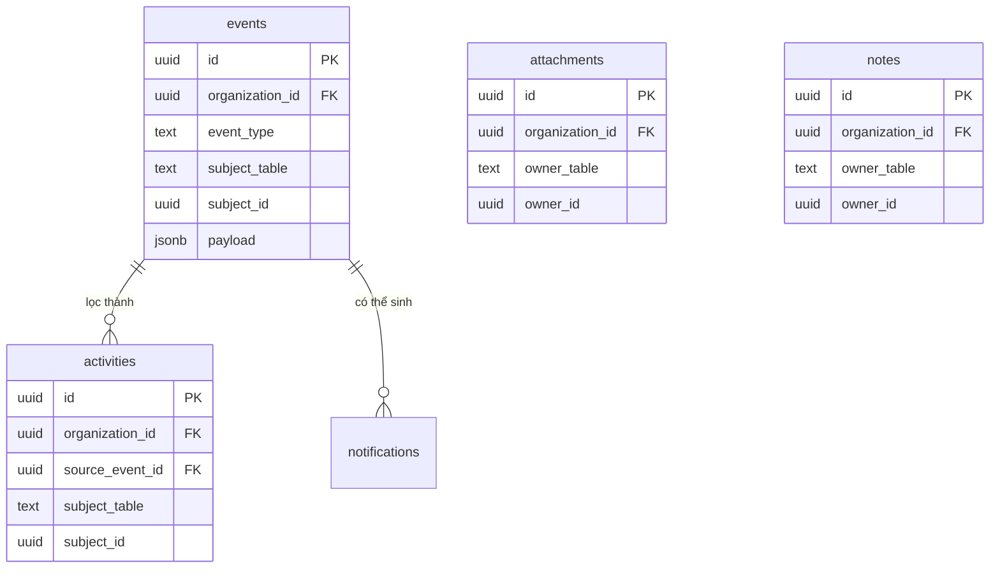
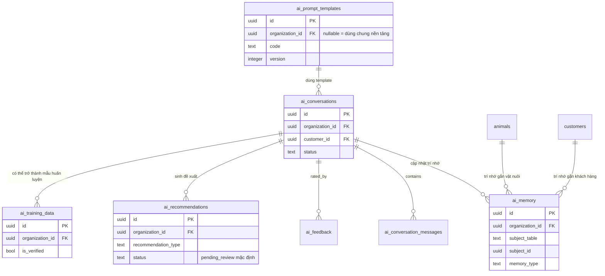
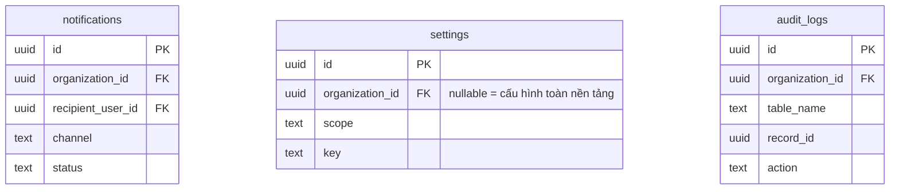

# 11. Kiến trúc dữ liệu (Database Architecture) — Phase 2

> **Sprint 1 Revision** — cập nhật theo quyết định Founder (Sprint 1: PASS
> WITH CHANGES): multi-tenant bằng bảng `organizations` (không dùng
> `dealer_id` làm ranh giới tenant), `animals` là trung tâm hồ sơ sức
> khỏe, thêm bảng `events` (timeline hệ thống) và 4 bảng AI
> (`ai_memory`, `ai_recommendations`, `ai_prompt_templates`,
> `ai_training_data`). Xem lịch sử thay đổi ở cuối file.

> **Phạm vi tài liệu này**: thiết kế kiến trúc, không phải migration. Không
> có lệnh SQL nào trong tài liệu này được chạy hay dự định chạy trực tiếp —
> đây là bản thiết kế để Founder/backend engineer review trước khi bất kỳ
> ai viết migration thật. Đặc tả chi tiết từng trường dữ liệu nằm ở
> [`12_SUPABASE_SCHEMA.md`](./12_SUPABASE_SCHEMA.md).

## Vì sao cần tài liệu này

Phase 1 đã xây `leads` (`supabase/migrations/0001_init.sql`) — một bảng
duy nhất, đủ cho website thu lead. Phase 2 mở rộng thành nền tảng dữ liệu
cho **toàn bộ hệ sinh thái VETJOY**: CRM, quản lý sản phẩm/kho, hồ sơ y tế
vật nuôi, đội ngũ bác sĩ/nhân viên, mạng lưới đại lý, và nền tảng cho AI
Assistant — theo đúng chuỗi kiến trúc đã đặt ra từ Phase 1:

```
Website → Lead → CRM (Customer/Animal Profile) → Consultation → Product
        → Follow-up → Vaccine/Reminder → VETJOY App → AI Assistant → Automation
```

## Animal là trung tâm của hồ sơ sức khỏe

**Quyết định Founder (Sprint 1 Revision)**: `animals` — không phải
`customers` — là thực thể trung tâm của toàn bộ dữ liệu y tế. Điều này
định hình lại cách đọc sơ đồ quan hệ:

- `customers` trả lời câu hỏi **"ai sở hữu/chịu trách nhiệm"** (chủ vật
  nuôi, người thanh toán, người nhận nhắc lịch).
- `animals` trả lời câu hỏi **"lịch sử sức khỏe của đối tượng này là gì"**
  — mọi `appointments`, `treatments`, `prescriptions`, `vaccinations` đều
  bắt buộc phải neo vào một `animals.id` cụ thể (không còn tuỳ chọn như
  bản thiết kế Sprint 1 gốc — xem thay đổi field `appointments.animal_id`
  ở [`12_SUPABASE_SCHEMA.md`](./12_SUPABASE_SCHEMA.md)).
- Với vật nuôi cá thể (chó/mèo), một `animals` = một cá thể. Với gia
  súc/gia cầm theo đàn, một `animals` (với `is_herd = true`) = **hồ sơ sức
  khỏe của cả đàn tại một thời điểm/thế hệ** — vẫn là trung tâm hồ sơ,
  chỉ khác đơn vị đại diện (cá thể vs. đàn).
- Hệ quả kiến trúc: khi thiết kế bất kỳ tính năng mới nào chạm tới sức
  khỏe vật nuôi (kể cả AI Assistant), luôn hỏi trước "gắn vào `animals`
  nào?" chứ không phải "gắn vào `customers` nào?" — customer chỉ nên xuất
  hiện gián tiếp qua `animals.customer_id`.

## Multi-tenant — Đã chốt: Hướng A (`organizations`)

> **Cập nhật Sprint 1 Revision**: bản thiết kế gốc đề xuất "Hướng B"
> (dùng `dealer_id` làm ranh giới tenant tạm thời). Founder đã quyết định
> chọn **Hướng A — multi-tenant đầy đủ bằng bảng `organizations`**, không
> dùng `dealer_id` cho mục đích này. `dealers` quay lại đúng vai trò
> nghiệp vụ ban đầu: một loại đối tác phân phối **thuộc về** một
> `organization`, không phải bản thân là ranh giới tenant.

### Bảng `organizations` (mới — bảng #35)

Là gốc của **mọi** dữ liệu nghiệp vụ trong hệ thống. Thiết kế tự tham
chiếu (`parent_organization_id`) để biểu diễn được cả 2 kịch bản mà không
cần đổi cấu trúc sau này:

- **Nhiều chi nhánh của cùng VETJOY** (mỗi chi nhánh là 1 `organizations`,
  cùng trỏ `parent_organization_id` về trụ sở chính).
- **Nền tảng phục vụ nhiều công ty thú y độc lập** (mô hình SaaS —
  `parent_organization_id = null`, mỗi công ty là 1 `organizations` gốc).

Đặc tả đầy đủ field ở
[`12_SUPABASE_SCHEMA.md`](./12_SUPABASE_SCHEMA.md#35-organizations).

### Cột `organization_id` — chuẩn hoá trên toàn bộ bảng nghiệp vụ

Từ Sprint 1 Revision, **mọi bảng nghiệp vụ** có thêm cột chuẩn thứ 5 (bên
cạnh `id`/`created_at`/`updated_at`/`deleted_at` đã có):
`organization_id uuid not null references organizations(id)`.

**Ngoại lệ — bảng dữ liệu tham chiếu dùng chung toàn hệ thống, KHÔNG có
`organization_id`** (vì bản chất là dữ liệu gốc chia sẻ giữa mọi tenant,
không thuộc riêng tổ chức nào):

| Bảng | Lý do dùng chung |
| --- | --- |
| `provinces`, `districts`, `communes` | Địa lý hành chính VN là dữ liệu quốc gia, không phụ thuộc tổ chức |
| `species`, `breeds` | Phân loại sinh học là dữ liệu khoa học chung |
| `roles`, `permissions` | Định nghĩa vai trò/quyền ở cấp hệ thống (một `organization` gán quyền cho user của mình qua `user_roles`, không định nghĩa lại bộ quyền) |
| `product_categories` | Danh mục sản phẩm là phân loại chung; sản phẩm cụ thể (`products`) mới thuộc về từng `organization` |
| `ai_prompt_templates` | Template AI mặc định dùng chung nền tảng — **có cột `organization_id` nullable** để tổ chức tự tuỳ biến prompt riêng nếu cần, null = dùng template mặc định toàn nền tảng |

Mọi bảng còn lại (kể cả `users`, `customers`, `animals`, `products`,
`ai_conversations`, `events`...) đều có `organization_id` bắt buộc.
**Ngoại lệ vai trò**: `super_admin` là vai trò duy nhất được phép truy
cập xuyên tổ chức (không bị RLS lọc theo `organization_id`) — dùng cho
đội vận hành nền tảng VETJOY, không phải cho nhân viên một tổ chức cụ
thể.

## Nguyên tắc thiết kế (áp dụng cho MỌI bảng trong `12_SUPABASE_SCHEMA.md`)

### 1. Khóa chính: UUID, không dùng số tự tăng

Mọi bảng dùng `id uuid` (Supabase mặc định `gen_random_uuid()`) làm khóa
chính, **không** dùng `serial`/`bigint identity`. Lý do trực tiếp phục vụ
2 yêu cầu bắt buộc của Phase 2:
- **Offline-ready**: app di động có thể sinh `id` ngay trên máy (khi chưa
  có mạng) mà không lo trùng với ID sinh ở server — điều kiện tiên quyết
  để đồng bộ hai chiều (offline-first sync).
- **AI-first / multi-tenant**: UUID không lộ thứ tự tạo bản ghi hay số
  lượng bản ghi — an toàn hơn khi lộ ra ngoài (API, AI context), và không
  va chạm giữa các `organization_id` khác nhau.

### 2. Soft delete, không xoá cứng

Mọi bảng nghiệp vụ có `deleted_at timestamptz null`. Xoá = set
`deleted_at = now()`, không `DELETE` vật lý. Lý do:
- Đồng bộ offline cần "tombstone" để thiết bị khác biết bản ghi đã bị xoá
  thay vì không thấy gì (không phân biệt được "xoá" và "chưa đồng bộ").
- `audit_logs`/`activities`/`events` cần dữ liệu gốc còn tồn tại để tra
  cứu lịch sử.
- Ngành thú y có yêu cầu truy vết (traceability) — không nên mất dữ liệu
  điều trị/vaccine dù khách hàng ngừng hợp tác.

### 3. Dấu vết thời gian & người thao tác

Mọi bảng có tối thiểu `created_at`, `updated_at` (`timestamptz`, default
`now()`). Bảng có ý nghĩa nghiệp vụ quan trọng (đơn hàng, điều trị, đơn
thuốc...) có thêm `created_by`/`updated_by` trỏ về `users.id`.

### 4. Multi-tenant bằng `organizations` (xem mục riêng ở trên)

### 5. AI-first (mở rộng ở Sprint 1 Revision)

Cụm AI giờ gồm 6 bảng thay vì 2:
- `ai_conversations`/`ai_conversation_messages`/`ai_feedback` (đã có từ
  Sprint 1 gốc) — phiên hội thoại và đánh giá chất lượng.
- `ai_memory` (**mới**) — trí nhớ dài hạn của AI về một `customers`/
  `animals` cụ thể, tồn tại **xuyên suốt nhiều phiên hội thoại** (khác
  `ai_conversation_messages` chỉ có ý nghĩa trong 1 phiên).
- `ai_recommendations` (**mới**) — đề xuất AI sinh ra (sản phẩm, next best
  action, nhắc lịch) nhưng **luôn ở trạng thái chờ duyệt** trước khi trở
  thành hành động thật — đúng nguyên tắc "AI không tự quyết định thay bác
  sĩ/nhân viên" đã có từ Phase 1.
- `ai_prompt_templates` (**mới**) — quản lý phiên bản prompt tập trung,
  để đổi hành vi AI mà không phải sửa code.
- `ai_training_data` (**mới**) — dữ liệu mẫu đã xác minh dùng để
  đánh giá/tinh chỉnh AI — **bắt buộc gắn cờ xác minh** (`is_verified`),
  tuyệt đối không tự động đưa hội thoại chưa kiểm duyệt vào tập này (rủi
  ro AI tự học lại câu trả lời sai).

Nguyên tắc bất biến từ Phase 1 vẫn giữ nguyên: AI không được tự bịa chẩn
đoán, liều dùng, chỉ định/chống chỉ định, giá, hay kết quả điều trị khi
dữ liệu chưa xác minh — 4 bảng AI mới được thiết kế để **ép buộc** nguyên
tắc này ở tầng dữ liệu (đề xuất luôn cần duyệt, dữ liệu huấn luyện luôn
cần xác minh) chứ không chỉ dựa vào việc dặn dò prompt.

### 6. CRM-first + `events` (timeline hệ thống — mới)

Sprint 1 Revision làm rõ **3 tầng ghi nhận lịch sử**, mỗi tầng một mục
đích, không thay thế nhau:

| Tầng | Bảng | Đối tượng đọc | Nội dung |
| --- | --- | --- | --- |
| Kỹ thuật/toàn hệ thống | `events` (**mới**) | Hệ thống, AI, automation, analytics | **Mọi** sự kiện xảy ra trong hệ thống (append-only, có thể rất nhiều dòng) — nguồn phát sinh cho `activities`, `notifications`, và tương lai là dữ liệu huấn luyện/phân tích |
| Nghiệp vụ dễ đọc | `activities` | Nhân viên/bác sĩ xem trong CRM | Tập con đã lọc/diễn giải của `events`, dùng để hiển thị "dòng thời gian khách hàng X" |
| Tuân thủ cấp thấp | `audit_logs` | Admin/kiểm toán | Riêng cho bảng nhạy cảm, ghi rõ giá trị field cũ/mới |

`events` là **nguồn sự thật duy nhất** (single source of truth) cho mọi
thứ xảy ra — `activities` và một phần `notifications` nên được sinh ra
**từ** `events` (qua trigger hoặc job xử lý), thay vì mỗi tính năng tự
ghi `activities` độc lập như thiết kế Sprint 1 gốc. Đây là thay đổi kiến
trúc quan trọng: `events` giữ vai trò **event log/event bus lite**, chuẩn
bị cho automation (Phase 2.5 trong `09_PHASE2_PLAN.md`) và huấn luyện AI
sau này mà không cần đổi lại tầng lưu trữ.

### 7. Mobile-first / Offline-ready

Ngoài UUID PK + soft delete (đã nêu trên): khuyến nghị mọi bảng có thể bị
sửa từ app di động cần thêm cơ chế đồng bộ ở tầng migration thật (chưa
liệt kê chi tiết ở Sprint 1 vì thuộc tầng đồng bộ, không phải tầng dữ
liệu nghiệp vụ) — chi tiết kỹ thuật đồng bộ nằm ngoài phạm vi Sprint 1
(xem [`15_PHASE2_ROADMAP.md`](./15_PHASE2_ROADMAP.md)).

### 8. Audit đầy đủ

Ba cơ chế `events` / `activities` / `audit_logs` (xem mục #6) cùng nhau
đảm bảo không có khoảng trống truy vết — từ sự kiện kỹ thuật, tới dòng
thời gian nghiệp vụ, tới nhật ký tuân thủ cấp field.

## Danh mục 40 bảng (34 gốc + 6 bảng thêm theo Sprint 1 Revision)

| # | Bảng | Cụm nghiệp vụ | Vai trò một câu |
| --- | --- | --- | --- |
| 1 | `users` | Định danh | Tài khoản đăng nhập gốc (map với Supabase Auth) |
| 2 | `roles` | Định danh | Vai trò hệ thống (admin, doctor, employee...) |
| 3 | `permissions` | Định danh | Quyền hạn chi tiết theo module |
| 4 | `customers` | Con người & Doanh nghiệp | Khách hàng (chủ vật nuôi/trang trại) |
| 5 | `farms` | Trang trại & Vật nuôi | Trang trại/hộ chăn nuôi của một khách hàng |
| 6 | `animals` | Trang trại & Vật nuôi | **Vật nuôi/đàn — trung tâm hồ sơ sức khỏe** |
| 7 | `species` | Trang trại & Vật nuôi | Loài (heo, gà, chó, mèo...) |
| 8 | `breeds` | Trang trại & Vật nuôi | Giống trong một loài |
| 9 | `products` | Danh mục & Kho | Sản phẩm bán ra |
| 10 | `product_categories` | Danh mục & Kho | Danh mục sản phẩm |
| 11 | `inventory` | Danh mục & Kho | Tồn kho theo sản phẩm/kho |
| 12 | `suppliers` | Danh mục & Kho | Nhà cung cấp |
| 13 | `purchase_orders` | Thương mại | Đơn mua hàng từ nhà cung cấp |
| 14 | `sales_orders` | Thương mại | Đơn bán cho khách hàng/đại lý |
| 15 | `invoices` | Thương mại | Hoá đơn |
| 16 | `prescriptions` | Y tế & Chăm sóc | Đơn thuốc bác sĩ kê |
| 17 | `treatments` | Y tế & Chăm sóc | Hồ sơ điều trị (VETJOY CARE bước 1–3) |
| 18 | `vaccinations` | Y tế & Chăm sóc | Lịch sử & lịch tiêm vaccine |
| 19 | `reminders` | Y tế & Chăm sóc | Nhắc lịch tổng quát (đa mục đích) |
| 20 | `appointments` | Y tế & Chăm sóc | Lịch hẹn tư vấn/khám |
| 21 | `doctors` | Con người & Doanh nghiệp | Hồ sơ bác sĩ thú y |
| 22 | `employees` | Con người & Doanh nghiệp | Hồ sơ nhân viên |
| 23 | `dealers` | Con người & Doanh nghiệp | Đại lý/đối tác phân phối (thuộc 1 `organization`) |
| 24 | `provinces` | Địa lý VN | Tỉnh/thành (dùng chung) |
| 25 | `districts` | Địa lý VN | Quận/huyện (dùng chung) |
| 26 | `communes` | Địa lý VN | Xã/phường (dùng chung) |
| 27 | `attachments` | CRM tổng quát | File đính kèm (polymorphic) |
| 28 | `notes` | CRM tổng quát | Ghi chú nội bộ (polymorphic) |
| 29 | `activities` | CRM tổng quát | Dòng thời gian dễ đọc (lọc từ `events`) |
| 30 | `ai_conversations` | AI | Phiên hội thoại với VETJOY AI |
| 31 | `ai_feedback` | AI | Phản hồi chất lượng câu trả lời AI |
| 32 | `notifications` | Nền tảng | Thông báo đa kênh |
| 33 | `settings` | Nền tảng | Cấu hình hệ thống dạng key-value |
| 34 | `audit_logs` | Nền tảng | Nhật ký thay đổi cấp thấp (tuân thủ) |
| **35** | **`organizations`** | **Định danh (mới)** | **Tenant gốc — mọi dữ liệu nghiệp vụ thuộc về 1 organization** |
| **36** | **`events`** | **CRM tổng quát (mới)** | **Timeline toàn hệ thống — nguồn phát sinh `activities`/`notifications`** |
| **37** | **`ai_memory`** | **AI (mới)** | **Trí nhớ dài hạn AI theo customer/animal, xuyên nhiều phiên** |
| **38** | **`ai_recommendations`** | **AI (mới)** | **Đề xuất AI — luôn ở trạng thái chờ duyệt** |
| **39** | **`ai_prompt_templates`** | **AI (mới)** | **Quản lý phiên bản prompt tập trung** |
| **40** | **`ai_training_data`** | **AI (mới)** | **Dữ liệu huấn luyện/đánh giá AI đã xác minh** |

## Bảng phụ trợ cần thiết (ngoài 40 bảng, minh bạch ghi nhận)

Không đổi so với Sprint 1 gốc — vẫn là hệ quả tự nhiên của chuẩn hoá dữ
liệu quan hệ:

| Bảng phụ trợ | Thuộc về | Lý do cần |
| --- | --- | --- |
| `user_roles` | `users` ↔ `roles` | Một user có thể có nhiều vai trò |
| `role_permissions` | `roles` ↔ `permissions` | Một vai trò có nhiều quyền |
| `purchase_order_items` | `purchase_orders` | Danh sách sản phẩm trong 1 đơn mua |
| `sales_order_items` | `sales_orders` | Danh sách sản phẩm trong 1 đơn bán |
| `prescription_items` | `prescriptions` | Danh sách thuốc/liều trong 1 đơn thuốc |
| `ai_conversation_messages` | `ai_conversations` | Từng tin nhắn trong 1 phiên hội thoại |

**Tổng số bảng vật lý dự kiến: 40 bảng nghiệp vụ + 6 bảng phụ trợ = 46
bảng.**

## ERD tổng quan (mối quan hệ chính, không đầy đủ field)



## ERD chi tiết theo cụm (kèm PK/FK chính)

### Cụm Multi-tenant & Định danh & Phân quyền



### Cụm Con người & Doanh nghiệp



### Cụm Trang trại & Vật nuôi (Animal-centric)



### Cụm Danh mục & Kho & Thương mại



### Cụm Y tế & Chăm sóc (VETJOY CARE 5 — Animal là gốc)



### Cụm CRM tổng quát & `events` (timeline hệ thống)



### Cụm AI (mở rộng — 6 bảng)



### Cụm Nền tảng



> **Ghi chú về "polymorphic"**: `attachments`, `notes`, `activities`,
> `events`, `ai_memory` dùng cặp cột `owner_table`/`owner_id` (hoặc
> `subject_table`/`subject_id`) thay vì một FK cứng — cho phép đính kèm
> file/ghi chú/sự kiện/trí nhớ vào BẤT KỲ bảng nào mà không phải tạo bảng
> nối riêng cho từng cặp quan hệ. Đánh đổi: Postgres không thể tạo FK
> constraint thật cho kiểu polymorphic này — tính toàn vẹn dữ liệu
> (owner_id phải tồn tại) cần được đảm bảo ở tầng ứng dụng hoặc qua
> trigger kiểm tra — cần lưu ý khi viết migration thật.

## Liên kết với `leads` (đã có từ Phase 1)

Không đổi so với Sprint 1 gốc: `leads` **không nằm trong danh mục 40
bảng** — vẫn là điểm vào (website), `customers` là điểm đến sau khi lead
được xác nhận, qua `customers.source_lead_id` (không FK cứng, khác
migration). Khi Founder xác nhận `organization_id` mặc định cho lead từ
website hiện tại (nếu VETJOY vận hành nhiều `organizations`, cần biết lead
thuộc tổ chức nào ngay từ form — có thể cần thêm cột `organization_id`
vào chính bảng `leads` ở một migration bổ sung sau, **ngoài phạm vi Sprint
1**).

## File liên quan

- Đặc tả chi tiết từng trường: [`12_SUPABASE_SCHEMA.md`](./12_SUPABASE_SCHEMA.md)
- Chiến lược RLS: [`13_RLS_POLICY_PLAN.md`](./13_RLS_POLICY_PLAN.md)
- Kế hoạch Storage: [`14_STORAGE_PLAN.md`](./14_STORAGE_PLAN.md)
- Roadmap kỹ thuật: [`15_PHASE2_ROADMAP.md`](./15_PHASE2_ROADMAP.md)
- Backlog theo Sprint: [`BACKLOG_PHASE2.md`](./BACKLOG_PHASE2.md)

## Lịch sử thay đổi tài liệu này

- **Sprint 1 (bản gốc)**: 34 bảng, đề xuất Hướng B (dealer làm ranh giới
  tenant tạm thời), customer-centric, `activities`/`audit_logs` (2 tầng).
- **Sprint 1 Revision (Founder duyệt "PASS WITH CHANGES")**: chốt Hướng A
  (`organizations`), chuyển sang animal-centric, thêm `events` (tầng thứ
  3, nguồn gốc cho `activities`), thêm 4 bảng AI (`ai_memory`,
  `ai_recommendations`, `ai_prompt_templates`, `ai_training_data`) → tổng
  40 bảng nghiệp vụ.
