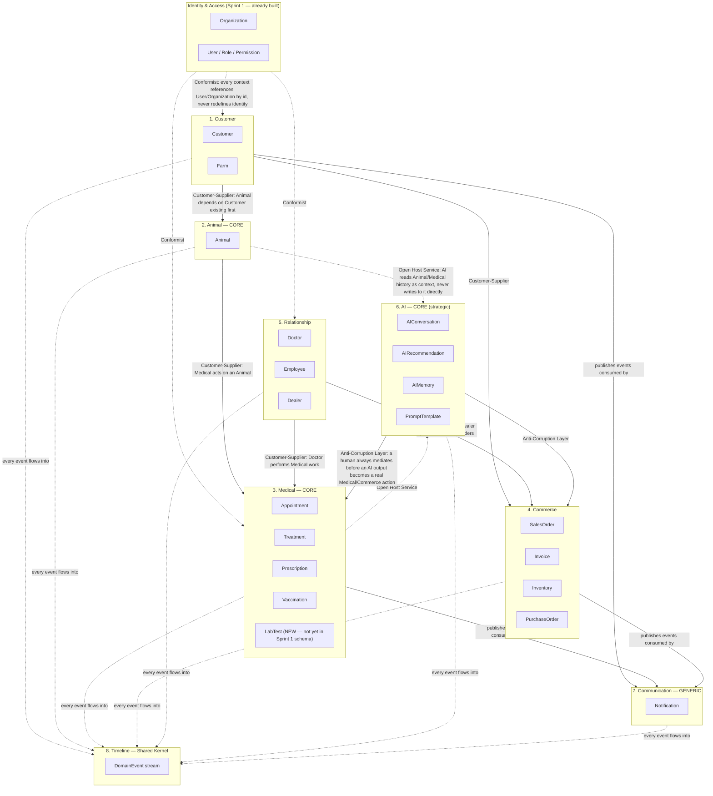

# 26. CRM Domain Model

> **Sprint 2.0 — Business analysis Sprint, not a programming Sprint.** No
> SQL, no migration, no source code changes. This document (and its
> companions `27`–`33`) describe VETJOY's CRM **business domain** —
> independent of database tables, independent of UI screens — as the
> foundation for however many future migration Sprints it takes to build
> it (each of which will follow the full pipeline in
> [`21_GOVERNANCE.md`](./21_GOVERNANCE.md)).
>
> **Method note**: this is written as Domain-Driven Design (DDD), not as
> a CRUD data model. The question asked of every domain below is "what
> business capability does this protect and enable", not "what table
> would this become". Where this document's shape happens to resemble
> the physical schema already approved in Sprint 1
> (`12_SUPABASE_SCHEMA.md`), that is because the schema was designed with
> this business shape already in mind — not because this document was
> reverse-engineered from the schema. Read this as: *the business reality
> the schema serves*, not *a description of the schema*.
>
> **Horizon**: this model is written for what VETJOY needs to be as a
> **10-year veterinary health platform**, not what a Phase 1 marketing
> website needs. Some capabilities described here (lab tests, AI
> learning loops, multi-organization franchising) are aspirational
> relative to what exists today — that is intentional; a domain model
> that only describes today's code is not a domain model, it's
> documentation of a database.

## Strategic classification

DDD asks which parts of the business are the actual competitive
advantage (**Core**), which are necessary but not differentiating
(**Supporting**), and which are commodity capability better bought than
built (**Generic**). This shapes where VETJOY should invest its own
engineering effort over the next 10 years versus where a third-party
service is the right long-term answer.

| Domain | Classification | Why |
| --- | --- | --- |
| 2. Animal | **Core** | The animal health record *is* VETJOY's differentiator per the founding brand positioning — "không chỉ bán thuốc". Nobody else in this market treats the animal, not the sale, as the central object. |
| 3. Medical | **Core** | VETJOY CARE 5 — the proprietary care methodology — lives here. This is the process VETJOY's 20+ years of expertise actually encodes. |
| 6. AI | **Core** (strategic, not yet realized) | The long-term differentiator is AI that understands a *specific animal's* history, not a generic chatbot. Building this shallow (a bought chatbot widget) would forfeit the advantage `32_ANIMAL_HEALTH_RECORD.md` describes. |
| 1. Customer | Supporting | Every CRM needs customer records. VETJOY's advantage isn't in *how* it tracks customers, it's in what it does once it has them (Domains 2/3/6). |
| 4. Commerce | Supporting | Necessary for revenue; not where VETJOY wins or loses against competitors. |
| 5. Relationship | Supporting | Staff/dealer/doctor management is operationally necessary, not differentiating. |
| 7. Communication | **Generic** | Sending a Zalo/SMS/email message is a solved problem elsewhere. Buy (a messaging provider), don't build a delivery engine. |
| 8. Timeline | Cross-cutting (Shared Kernel) | Not a business domain with its own decisions/invariants — it is the substrate every other domain's history is recorded onto. Treated separately below. |

**Implication for Founder**: engineering investment (custom logic, careful
design, "worth getting exactly right") should concentrate on Animal,
Medical, and AI. Customer, Commerce, Relationship should be built
soundly but not gold-plated. Communication should default to whatever
Zalo/email/SMS provider integration is fastest to adopt, revisited only
if it becomes a genuine bottleneck.

## Bounded Context Diagram

**Relationship pattern legend** (standard DDD context-mapping vocabulary):
- **Conformist**: the downstream context accepts the upstream's model
  as-is, no translation. Every business domain conforms to Identity &
  Access's definition of `User`/`Organization` rather than each
  maintaining its own notion of identity.
- **Customer-Supplier**: upstream can evolve somewhat independently, but
  downstream's needs genuinely constrain it (e.g. Medical's need for an
  `Animal` to already exist shapes how Animal registration must work).
- **Open Host Service**: AI is deliberately a *reader* of Animal/Medical
  data through a stable, intentional interface — it does not reach in and
  restructure those contexts' internals.
- **Anti-Corruption Layer**: a deliberate translation/gate between AI's
  probabilistic output and the deterministic, human-accountable Medical/
  Commerce contexts — this is where "AI không tự bịa" (established since
  Phase 1) is enforced structurally, not just by policy. See
  `30_AI_DOMAIN.md`.

## Aggregate Design

An **Aggregate Root** is the single entry point through which a cluster
of related objects must be changed, so the aggregate can enforce its own
invariants. Everything else in this section is either an **Entity**
(has identity, lives inside the aggregate) or a **Value Object** (no
identity, defined only by its values) contained within a root, or a
reference to another aggregate **by ID only** (never embedded, never
directly mutated from outside its own root).

| Aggregate Root | Domain | Contains (entities/value objects) | References by ID only |
| --- | --- | --- | --- |
| `Customer` | 1 | Contact details (VO), `CustomerType` (VO) | `Organization`, `Dealer` (assigned), source `Lead` |
| `Farm` | 1 | Address (VO), capacity (VO) | `Customer` (owner) |
| `Animal` | 2 | Identity (VO: species/breed/name/code), current status (VO) | `Customer` (current owner), `Farm` (current location) — **does not** contain Health Record, Timeline, Owner/Farm/AI History as embedded data; see `32_ANIMAL_HEALTH_RECORD.md` for why these are projections, not aggregate contents |
| `Appointment` | 3 | Scheduling detail (VO) | `Animal`, `Customer`, `Doctor` |
| `Treatment` | 3 | Chief complaint / assessment / plan (VO — the VETJOY CARE 5 record itself) | `Animal`, `Doctor`, `Appointment` |
| `Prescription` | 3 | Prescription line items (Entities — each has its own dosage/quantity) | `Treatment`, `Animal`, `Doctor`, `Product` (Commerce) |
| `Vaccination` | 3 | Administration detail (VO) | `Animal`, `Product` (Commerce), `Doctor` |
| `LabTest` **(new concept)** | 3 | Ordered panel (VO), result set (Entity, added when resulted) | `Animal`, `Doctor` |
| `SalesOrder` | 4 | Line items (Entities) | `Customer`, `Dealer` |
| `Invoice` | 4 | — | `SalesOrder`, `Customer` |
| `Inventory` | 4 | Stock level (VO) | `Product` |
| `PurchaseOrder` | 4 | Line items (Entities) | `Supplier` |
| `Doctor` | 5 | Credentials (VO) | `User` (Identity & Access) |
| `Employee` | 5 | Employment detail (VO) | `User` |
| `Dealer` | 5 | Business detail (VO) | `User`, `Organization` |
| `AIConversation` | 6 | Message thread (Entities) | `Customer`, `Animal` (context), `Doctor` (if handed off) |
| `AIRecommendation` | 6 | Proposed content (VO) | `AIConversation`, target `Animal`/`Customer` |
| `AIMemory` | 6 | Remembered fact (VO) | `Customer`/`Animal` (subject), `AIConversation` (source) |
| `PromptTemplate` | 6 | Template body (VO), version (VO) | — |
| `Notification` | 7 | Message content (VO), channel (VO) | Recipient `User`/`Customer` |

**Why so many small aggregates instead of a few large ones**: this is
the central DDD discipline applied throughout — e.g. `Prescription` is
NOT a child collection inside `Treatment`, because a prescription's own
lifecycle (dispensed → completed) legitimately changes independently of
the clinical note it originated from, and forcing every prescription
status change to go through the (larger, more contended) `Treatment`
aggregate would be exactly the kind of accidental coupling DDD aggregate
boundaries exist to prevent. This mirrors — and explains the business
reasoning behind — the already-approved separate-tables design in
`12_SUPABASE_SCHEMA.md`.

## Ubiquitous Language

The shared vocabulary every future conversation (business, engineering,
AI prompt design) about this domain should use consistently — deviating
from these terms in code, docs, or conversation is itself a signal
something is being modeled wrong.

| Term | Means | Does NOT mean |
| --- | --- | --- |
| **Customer** | Anyone VETJOY has a commercial/care relationship with — an individual owner, a dealer, a clinic, a farm business | A person with a login (that's a `User`, Identity & Access context) |
| **Animal** | One health-record unit — either a single pet or one herd-generation record (`is_herd = true`) | A product SKU or inventory item |
| **Herd** | An `Animal` record representing a group (gia súc/gia cầm) rather than an individual | A separate concept from Animal — it *is* an Animal, just one with `is_herd = true` |
| **Encounter** (= `Treatment` aggregate) | One clinical visit's full record: chief complaint, assessment, plan | A single database row with no business meaning of its own |
| **Chief Complaint / Đánh giá / Giải pháp** | The VETJOY CARE 5 steps 1–3, captured as the Encounter's core content | Free-text notes with no structure |
| **Care Plan** | The "Giải pháp" (step 3) output of an Encounter — what should happen next | A prescription (a Care Plan may or may not include one) |
| **Lead** | A person who has expressed interest via the website but is not yet a `Customer` | Interchangeable with Customer — a Lead becomes a Customer only on conversion, see `31_CUSTOMER_JOURNEY.md` |
| **Recommendation** (AI) | An AI-proposed action awaiting human review — never a decision already made | An instruction the system will act on automatically |
| **Memory** (AI) | A durable fact an AI has recorded about a Customer/Animal across conversations | A verified medical fact (memory becomes trustworthy only once a human verifies it — see `30_AI_DOMAIN.md`) |
| **Timeline** | The chronological, cross-domain event history for a given Customer/Animal | A UI feature — it's a domain concept first, a screen second |
| **Bounded Context** | A part of the business with its own consistent model and language (this document's Domains) | A database schema or a microservice (it may or may not become either) |
| **Aggregate** | A cluster of objects treated as one unit for consistency, entered only through its root | A "table" — the mapping to tables is an implementation detail, not the definition |

## Domain 1 — Customer

**1. Mục tiêu**: represent every party VETJOY has a commercial or care
relationship with — individual pet/livestock owners, farm businesses,
veterinary dealers/distributors, and (in the future) partner clinics —
under one consistent model, so the rest of the business doesn't need a
different "customer concept" per persona.

**2. Vai trò**: `Customer` (the aggregate itself, self-service or
staff-managed); `Employee`/`Doctor` (create/maintain Customer records
during onboarding or a visit); `Dealer` (a `Customer`'s assigned
distribution partner, itself modeled in Domain 5).

**3. Đối tượng**: individual owner (gia súc/gia cầm/thú cưng persona),
farm-owning business, dealer/clinic acting as a customer of VETJOY's own
supply chain. See `31_CUSTOMER_JOURNEY.md` for how each persona actually
experiences this.

**4. Business Rule**: see [`27_BUSINESS_RULES.md`](./27_BUSINESS_RULES.md)
rules **BR-CUST-01 through BR-CUST-06**. Highlight: a Customer must
always be traceable back to its originating `Lead` when one exists
(BR-CUST-02) — this is the seam that makes the website's lead-capture
work (Phase 1) actually pay off in the CRM (Phase 2).

**5. Life Cycle**: see [`28_CRM_LIFECYCLE.md`](./28_CRM_LIFECYCLE.md)
"Customer Lifecycle".

**6. Relationship**: 1-to-many with `Farm` and `Animal` (an owner may
have several farms/animals); many-to-one with `Dealer` (a dealer may be
assigned many Customers, but a Customer has at most one assigned Dealer
at a time); every `Customer` is optionally linked to one `User`
(Identity & Access) if they have portal/app access.

**7. Rủi ro**: (a) a Customer record duplicated across channels (website
lead, dealer-entered, walk-in) without being recognized as the same
person — matching/deduplication logic is a real design problem not yet
solved by this Sprint, flagged for Founder; (b) PII handling — Customer
is the primary holder of personal data (phone/address) and must be the
first place privacy/consent rules (already established in
`06_CONTENT_GUIDE.md`/website forms) are honored end-to-end into the CRM.

**8. Khả năng mở rộng**: multi-organization franchising (a Customer could
in principle belong to more than one `Organization` if VETJOY becomes a
platform for multiple vet businesses — deliberately not designed for yet,
see `11_DATABASE_ARCHITECTURE.md` multi-tenant discussion); B2B customer
hierarchies (a farm business with multiple sub-locations, each with its
own contact).

## Domain 2 — Animal

Fully detailed in its own document: [`32_ANIMAL_HEALTH_RECORD.md`](./32_ANIMAL_HEALTH_RECORD.md)
(mục tiêu, vai trò, đối tượng, business rules BR-ANIM-01…, life cycle,
relationship, rủi ro, khả năng mở rộng — including the Identity / Health
Record / Timeline / Owner History / Farm History / AI History structure
requested for this domain specifically). Summary: **Core domain**, the
`Animal` aggregate is deliberately small (identity + current state only);
everything else asked of "mỗi Animal phải có" is a projection built from
Domain Events (Domain 8), not data stored inside the aggregate — see that
document for the full reasoning.

## Domain 3 — Medical

**1. Mục tiêu**: encode VETJOY's actual clinical process (VETJOY CARE 5)
as first-class domain objects, so "what happened medically" is always
traceable, auditable, and buildable-upon (by staff, by future AI) rather
than living only in free-text notes.

**2. Vai trò**: `Doctor` (performs/records Encounters, issues
Prescriptions, orders LabTests); `Employee` (schedules Appointments,
assists); `Customer` (requests Appointments, receives Care Plans).

**3. Đối tượng**: `Appointment`, `Treatment` (Encounter), `Prescription`,
`Vaccination`, `LabTest` (new concept — see below).

**4. Business Rule**: [`27_BUSINESS_RULES.md`](./27_BUSINESS_RULES.md)
**BR-MED-01 through BR-MED-10**. Highlight: BR-MED-01 — every
`Treatment`/`Prescription`/`Vaccination`/`LabTest` **must** reference an
`Animal` (animal-centric, no orphaned medical records — already enforced
at the schema level for Treatment/Appointment per Sprint 1.5, this rule
generalizes it to the newly-identified `LabTest` concept too).

**5. Life Cycle**: [`28_CRM_LIFECYCLE.md`](./28_CRM_LIFECYCLE.md)
"Appointment", "Treatment", "Prescription", "Vaccination", "LabTest"
lifecycles.

**6. Relationship**: every Medical aggregate references exactly one
`Animal` (Domain 2); `Treatment` may reference an originating
`Appointment`; `Prescription`/`Vaccination` reference `Product` entries
from Commerce (Domain 4) for what was prescribed/administered; a
completed `Treatment` may generate an `AIMemory` entry (Domain 6) if a
notable fact should be remembered long-term (e.g. an allergy).

**7. Rủi ro**: this is the highest-liability domain in the entire system
— an incorrect dosage, missed contraindication, or fabricated diagnosis
has real-world animal-welfare and legal consequences. Every rule in
`06_CONTENT_GUIDE.md`/`13_RLS_POLICY_PLAN.md` about never fabricating
medical content applies here with the most force. **LabTest is a newly
identified concept during this Sprint's analysis** — it does not exist in
the Sprint 1 physical schema (`12_SUPABASE_SCHEMA.md`'s 46 tables) and
must go through its own Architecture → Review → ... → Production pipeline
in a future Sprint before it can be built (see report at the end of this
Sprint).

**8. Khả năng mở rộng**: multi-visit care plans (a `Treatment` that
spans several follow-up Appointments rather than one visit — not modeled
yet, current `Treatment` assumes one Encounter = one record); telemedicine
(remote Encounter without a physical Appointment); lab result integration
with external diagnostic providers.

## Domain 4 — Commerce

**1. Mục tiêu**: support the transactional side of the business (selling
products, buying stock, invoicing) without letting commerce logic leak
into — or gate — the medical/animal-welfare side of the business (a
Customer's ability to receive care must never be blocked by an unrelated
unpaid invoice, for example — an explicit business rule, see below).

**2. Vai trò**: `Customer`/`Dealer` (place `SalesOrder`s); `Employee`
(manages `Inventory`, places `PurchaseOrder`s to `Supplier`s); `Doctor`
(indirectly — a `Prescription`/`Vaccination` consumes `Product` stock).

**3. Đối tượng**: `SalesOrder`, `Invoice`, `Inventory`, `PurchaseOrder`,
`Supplier`, `Product` (the catalog itself — already designed in Sprint 1
as `products`/`product_categories`).

**4. Business Rule**: [`27_BUSINESS_RULES.md`](./27_BUSINESS_RULES.md)
**BR-COM-01 through BR-COM-07**. Highlight: BR-COM-05 — an unpaid
`Invoice` must never block a `Treatment`/`Prescription`/`Vaccination`
from being recorded for an `Animal` (medical care is never gated by
billing status — a deliberate business/ethical decision, not an
oversight).

**5. Life Cycle**: [`28_CRM_LIFECYCLE.md`](./28_CRM_LIFECYCLE.md)
"SalesOrder", "Invoice", "PurchaseOrder" lifecycles.

**6. Relationship**: `SalesOrder`/`Invoice` reference `Customer` and
optionally `Dealer`; `Prescription`/`Vaccination` (Medical) consume
`Product`/`Inventory` but do not themselves create a `SalesOrder` (a
Care Plan recommending a product and a Customer purchasing that product
are related but distinct events — see `29_DOMAIN_EVENTS.md`).

**7. Rủi ro**: inventory/financial data has real accounting implications
— accuracy and audit trail matter (this is why `audit_logs`, already
built in Sprint 1.5, is explicitly required for `invoices` per
`13_RLS_POLICY_PLAN.md`'s sensitivity table). Reconciling `Inventory`
consumption from Medical (a vaccine used in a `Vaccination`) against
Commerce's own stock-out logic needs a clearly-owned single source of
truth (Commerce owns `Inventory`; Medical only *decrements* it via an
event, never edits it directly).

**8. Khả năng mở rộng**: multi-warehouse/multi-branch inventory (hierarchy
already supported at the `organizations` level per Sprint 1.5 — Commerce
should reuse that rather than inventing its own branch concept); online
payment integration (explicitly out of scope per the original Phase 1
brief, "không xây payment gateway" — still true at this Sprint).

## Domain 5 — Relationship

**1. Mục tiêu**: represent the people and businesses VETJOY works
*through* (staff and channel partners) as distinct from the people it
works *for* (Domain 1 Customer) — each with the specific professional
attributes their role requires (a license number for a Doctor, a business
scale for a Dealer) without polluting the generic `User` identity concept.

**2. Vai trò**: `Doctor`, `Employee`, `Dealer` — each is itself both an
aggregate root in this domain and a "vai trò" (role) relative to other
domains (a Doctor performs Medical work; a Dealer facilitates Commerce).

**3. Đối tượng**: `Doctor` (license, specialties, bio), `Employee`
(department, position), `Dealer` (business name, scale, assigned
Customers).

**4. Business Rule**: [`27_BUSINESS_RULES.md`](./27_BUSINESS_RULES.md)
**BR-REL-01 through BR-REL-05**. Highlight: BR-REL-03 — a `Dealer` is a
commercial relationship, never a data-visibility tenant boundary (this
was an explicit architectural correction made in Sprint 1 Revision — see
`11_DATABASE_ARCHITECTURE.md` — and remains true at the business-model
level here, not just the schema level).

**5. Life Cycle**: [`28_CRM_LIFECYCLE.md`](./28_CRM_LIFECYCLE.md)
"Doctor/Employee/Dealer Lifecycle".

**6. Relationship**: each of the three references exactly one `User`
(Identity & Access, Sprint 1) — this domain does not re-implement login/
auth, it adds business meaning on top of an identity that already exists
there.

**7. Rủi ro**: a Doctor's public-facing bio/credentials (shown on the
website per `06_CONTENT_GUIDE.md`) must stay in sync with — but is not
identical to — their internal `license_no` (which should never be public,
per `13_RLS_POLICY_PLAN.md` Nhóm A's `doctors_public` view note). Getting
this public/private split wrong is both a privacy and a credibility risk.

**8. Khả năng mở rộng**: multi-clinic Doctor assignments (a Doctor working
across more than one branch `organizations`); Dealer tiers/incentive
programs (not modeled — would be a new sub-concept under Dealer, not a
new Domain).

## Domain 6 — AI

Fully detailed in its own document: [`30_AI_DOMAIN.md`](./30_AI_DOMAIN.md).
Summary: **Core domain (strategic)**. Everything AI proposes
(`AIRecommendation`) or remembers (`AIMemory`) is explicitly *not*
authoritative until a human in Domain 3/4/5 confirms it — the
Anti-Corruption Layer pattern from the Bounded Context Diagram above is
this domain's central design constraint, carried forward unchanged from
the "AI không tự bịa" principle established in the original Phase 1
brief and re-enforced at the schema level in Sprint 1.5
(`ai_recommendations.status` defaults to `pending_review`,
`ai_memory.is_verified` defaults to `false`).

## Domain 7 — Communication

**1. Mục tiêu**: deliver a message to a Customer/User through whichever
channel is appropriate (Zalo, Facebook, email, SMS, call, in-app
notification) without every other domain needing to know or care which
channel was actually used.

**2. Vai trò**: every other domain (Customer, Medical, Commerce...) is a
*producer* of the business events that trigger a Notification; this
domain is purely the delivery mechanism.

**3. Đối tượng**: `Notification` (one attempt to deliver one message
through one channel).

**4. Business Rule**: [`27_BUSINESS_RULES.md`](./27_BUSINESS_RULES.md)
**BR-COMM-01 through BR-COMM-04**. Highlight: BR-COMM-02 — channel choice
(Zalo vs. SMS vs. email) is a Customer preference/fallback policy, never
hardcoded per event type.

**5. Life Cycle**: [`28_CRM_LIFECYCLE.md`](./28_CRM_LIFECYCLE.md)
"Notification Lifecycle".

**6. Relationship**: consumes Domain Events from every other domain
(Domain 8 Timeline is the mechanism); does not itself modify any other
domain's state.

**7. Rủi ro**: this is the domain most exposed to third-party platform
policy risk (Zalo/Facebook API changes, message-template approval
requirements, delivery rate limits) — none of which VETJOY controls.
Treating it as Generic (buy, don't build deeply) is precisely because of
this exposure.

**8. Khả năng mở rộng**: this is the most straightforward domain to
outsource entirely to a communications platform (e.g. a
notification-as-a-service provider) without losing any VETJOY-specific
value — unlike Animal/Medical/AI, there is little reason to build this
deeply in-house long-term.

## Domain 8 — Timeline

**1. Mục tiêu**: guarantee that *no* significant business fact, in any
domain, is ever lost or un-traceable — the single substrate every other
domain's history is recorded onto. This is the business articulation of
the `events` table decision already made in Sprint 1 Revision.

**2. Vai trò**: every domain is a producer; CRM users (staff, and
eventually Customers themselves, scoped appropriately) and the AI domain
are consumers, reading a Timeline to understand "what has happened" for
a given Customer/Animal/Order.

**3. Đối tượng**: `DomainEvent` (an immutable record: what happened, to
what, when, by/because of whom or what).

**4. Business Rule**: [`27_BUSINESS_RULES.md`](./27_BUSINESS_RULES.md)
**BR-TL-01 through BR-TL-03**. Highlight: BR-TL-01 — every event is
append-only and immutable, forever (this is the business rule that
`audit_logs`'s trigger-enforced immutability in Sprint 1.5 exists to
guarantee at the schema level).

**5. Life Cycle**: none — a `DomainEvent`, once recorded, has no further
lifecycle. This is itself the defining characteristic that separates
Domain 8 from the other seven (see note below).

**6. Relationship**: referenced by (not referencing) every other domain.

**7. Rủi ro**: volume — a 10-year, multi-organization platform will
generate a very large number of events; query/retention strategy needs
real engineering attention when this is actually built (partitioning,
archival), not a concern for this business-analysis Sprint but flagged
for whoever designs its eventual migration.

**8. Khả năng mở rộng**: this is the natural foundation for future
analytics, automation (`09_PHASE2_PLAN.md` Phase 2.5), and AI training
data curation (`30_AI_DOMAIN.md`) — once it exists, most future "smart"
features are built by *reading* Timeline, not by adding new bespoke
tracking to each domain.

**Why Timeline is not a Bounded Context like the other 7**: it has no
business invariants of its own to protect (an event, once true, cannot
become "more true" or be validated against competing business rules the
way a `SalesOrder` total must reconcile against its line items) — it is
purely a **Shared Kernel**: a piece of model every other context depends
on and must agree on the shape of. Modeling it as an eighth peer
"Domain" (as the Founder's brief frames it) is a completely reasonable
business-language framing; this document notes the DDD nuance
(Shared Kernel vs. Bounded Context) for engineering precision without
disagreeing with the business framing.

## File liên quan

- Business rule catalog: [`27_BUSINESS_RULES.md`](./27_BUSINESS_RULES.md)
- Lifecycle diagrams: [`28_CRM_LIFECYCLE.md`](./28_CRM_LIFECYCLE.md)
- Domain events + Event Storming: [`29_DOMAIN_EVENTS.md`](./29_DOMAIN_EVENTS.md)
- AI domain deep dive: [`30_AI_DOMAIN.md`](./30_AI_DOMAIN.md)
- Customer journey: [`31_CUSTOMER_JOURNEY.md`](./31_CUSTOMER_JOURNEY.md)
- Animal domain deep dive: [`32_ANIMAL_HEALTH_RECORD.md`](./32_ANIMAL_HEALTH_RECORD.md)
- VETJOY CARE 5 mapping: [`33_VETJOY_CARE5_MAPPING.md`](./33_VETJOY_CARE5_MAPPING.md)
- Existing physical schema this model will eventually be migrated onto: [`12_SUPABASE_SCHEMA.md`](./12_SUPABASE_SCHEMA.md)
- Governance for however this gets built: [`21_GOVERNANCE.md`](./21_GOVERNANCE.md)
