# 28. CRM Lifecycle (state machines)

> State-machine view of every Aggregate Root defined in
> [`26_DOMAIN_MODEL.md`](./26_DOMAIN_MODEL.md). Each diagram shows the
> **business states** an aggregate can be in and what event (Domain 8,
> catalogued in full in [`29_DOMAIN_EVENTS.md`](./29_DOMAIN_EVENTS.md))
> causes a transition — not database status columns, though a future
> migration's `status` enum will likely map closely onto these states.

## Customer Lifecycle

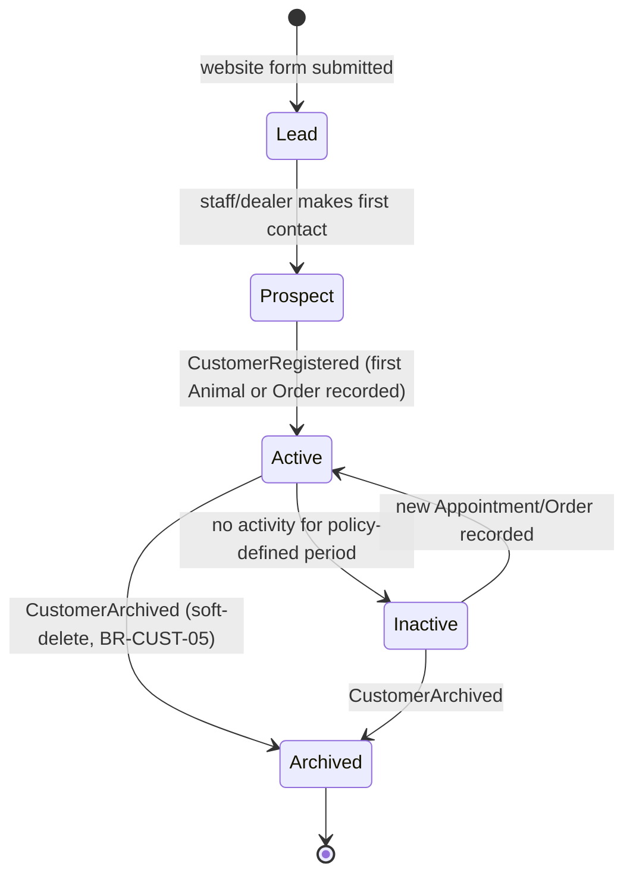
```mermaid
stateDiagram-v2
  [*] --> Lead: website form submitted
  Lead --> Prospect: staff/dealer makes first contact
  Prospect --> Active: CustomerRegistered (first Animal or Order recorded)
  Active --> Inactive: no activity for policy-defined period
  Inactive --> Active: new Appointment/Order recorded
  Active --> Archived: CustomerArchived (soft-delete, BR-CUST-05)
  Inactive --> Archived: CustomerArchived
  Archived --> [*]
```

*Note*: `Lead` here is the pre-Customer state described in
`31_CUSTOMER_JOURNEY.md` — a Lead is not yet the `Customer` aggregate,
it becomes one only at `CustomerRegistered` (BR-CUST-02 requires the
link back be preserved).

## Farm Lifecycle

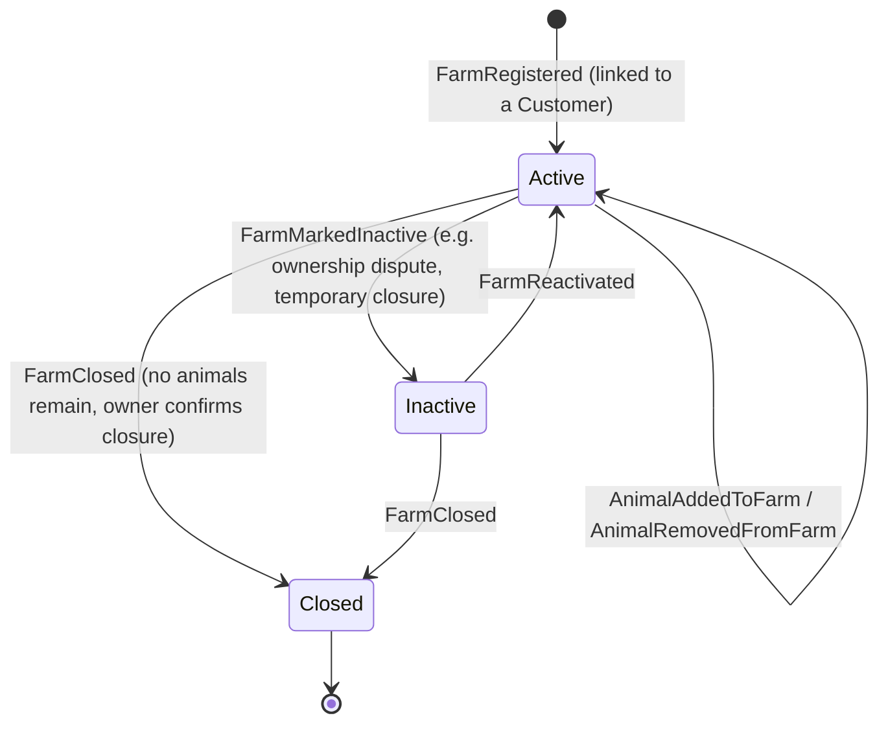
```mermaid
stateDiagram-v2
  [*] --> Active: FarmRegistered (linked to a Customer)
  Active --> Active: AnimalAddedToFarm / AnimalRemovedFromFarm
  Active --> Inactive: FarmMarkedInactive (e.g. ownership dispute, temporary closure)
  Inactive --> Active: FarmReactivated
  Active --> Closed: FarmClosed (no animals remain, owner confirms closure)
  Inactive --> Closed: FarmClosed
  Closed --> [*]
```

## Animal Lifecycle

Full detail (including why History is a projection, not a state field)
in [`32_ANIMAL_HEALTH_RECORD.md`](./32_ANIMAL_HEALTH_RECORD.md). Summary
state machine:

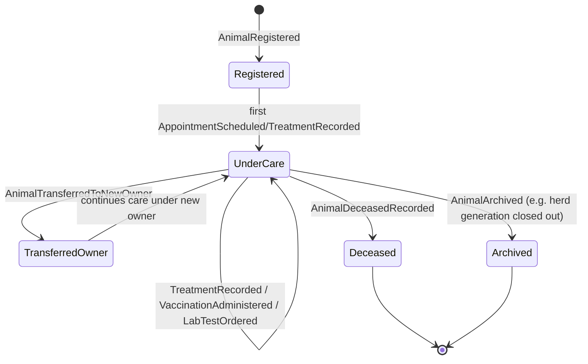
```mermaid
stateDiagram-v2
  [*] --> Registered: AnimalRegistered
  Registered --> UnderCare: first AppointmentScheduled/TreatmentRecorded
  UnderCare --> UnderCare: TreatmentRecorded / VaccinationAdministered / LabTestOrdered
  UnderCare --> TransferredOwner: AnimalTransferredToNewOwner
  TransferredOwner --> UnderCare: continues care under new owner
  UnderCare --> Deceased: AnimalDeceasedRecorded
  UnderCare --> Archived: AnimalArchived (e.g. herd generation closed out)
  Deceased --> [*]
  Archived --> [*]
```

*Note*: `TransferredOwner` is drawn as a distinct state (not just a
side-event) because BR-ANIM rules (see
`32_ANIMAL_HEALTH_RECORD.md`) require Owner History to reflect exactly
when this happened — it is business-meaningful, not incidental.

## Appointment Lifecycle

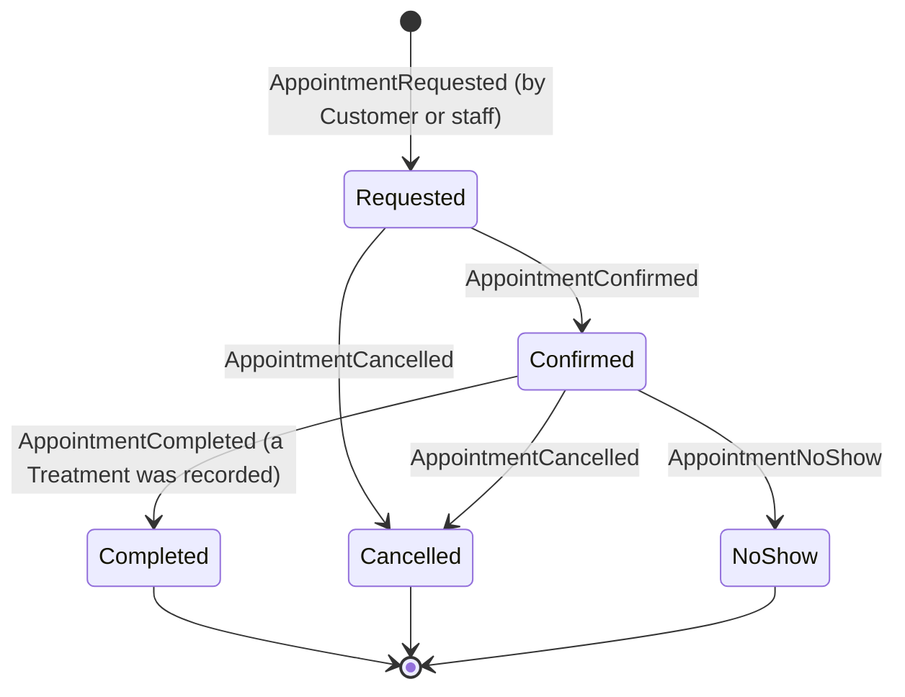
```mermaid
stateDiagram-v2
  [*] --> Requested: AppointmentRequested (by Customer or staff)
  Requested --> Confirmed: AppointmentConfirmed
  Confirmed --> Completed: AppointmentCompleted (a Treatment was recorded)
  Requested --> Cancelled: AppointmentCancelled
  Confirmed --> Cancelled: AppointmentCancelled
  Confirmed --> NoShow: AppointmentNoShow
  Completed --> [*]
  Cancelled --> [*]
  NoShow --> [*]
```

## Treatment (Encounter) Lifecycle

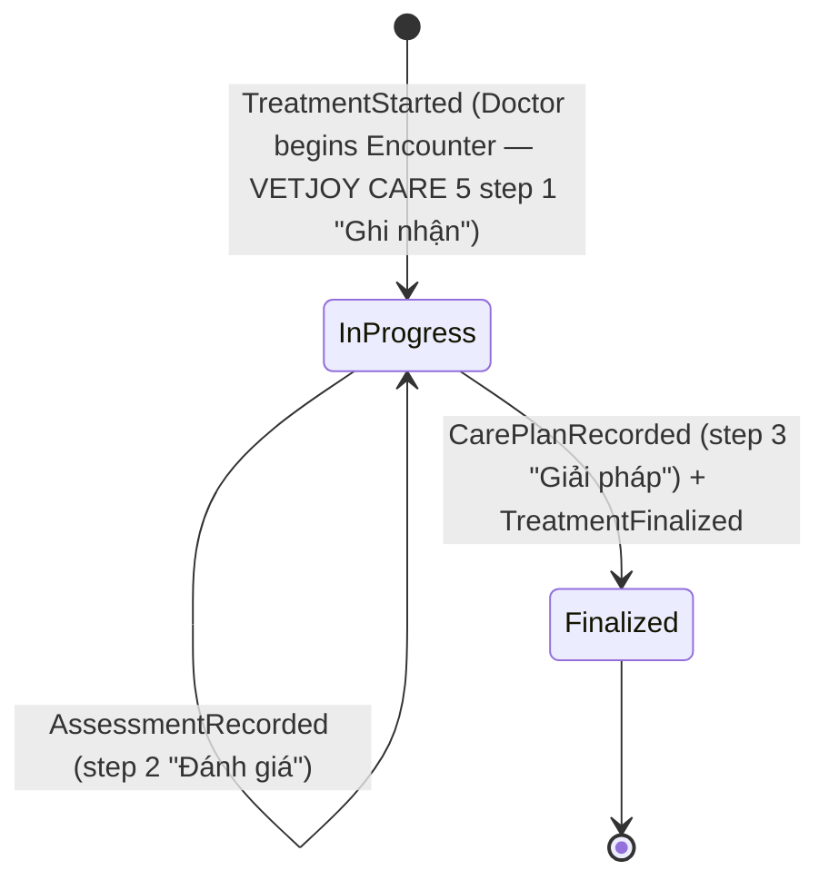
```mermaid
stateDiagram-v2
  [*] --> InProgress: TreatmentStarted (Doctor begins Encounter — VETJOY CARE 5 step 1 "Ghi nhận")
  InProgress --> InProgress: AssessmentRecorded (step 2 "Đánh giá")
  InProgress --> Finalized: CarePlanRecorded (step 3 "Giải pháp") + TreatmentFinalized
  Finalized --> [*]
```

*Note*: BR-MED-06 — once `Finalized`, a `Treatment` is never deleted; a
correction is a new, linked `TreatmentAmended` event, not a state
re-entry. Maps onto VETJOY CARE 5 steps 4–5 ("Theo dõi", "Chăm sóc tiếp")
as *subsequent* Treatments/Appointments referencing this one — see
`33_VETJOY_CARE5_MAPPING.md`.

## Prescription Lifecycle

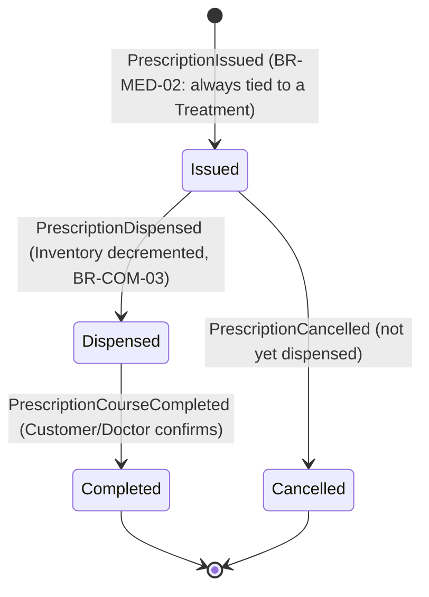
```mermaid
stateDiagram-v2
  [*] --> Issued: PrescriptionIssued (BR-MED-02: always tied to a Treatment)
  Issued --> Dispensed: PrescriptionDispensed (Inventory decremented, BR-COM-03)
  Dispensed --> Completed: PrescriptionCourseCompleted (Customer/Doctor confirms)
  Issued --> Cancelled: PrescriptionCancelled (not yet dispensed)
  Completed --> [*]
  Cancelled --> [*]
```

## Vaccination Lifecycle

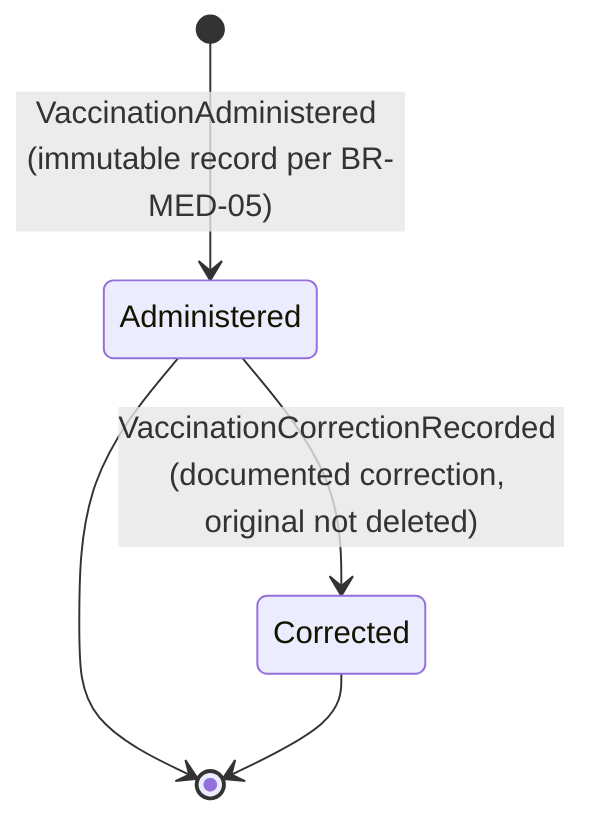
```mermaid
stateDiagram-v2
  [*] --> Administered: VaccinationAdministered (immutable record per BR-MED-05)
  Administered --> Corrected: VaccinationCorrectionRecorded (documented correction, original not deleted)
  Administered --> [*]
  Corrected --> [*]
```

## LabTest Lifecycle (new concept — not yet buildable, see BR-MED-10)

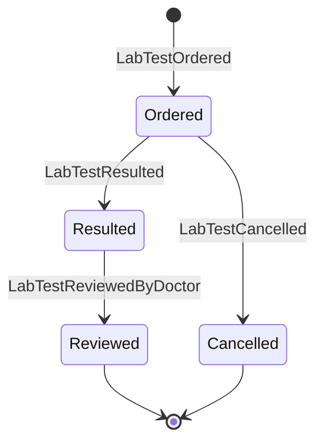
```mermaid
stateDiagram-v2
  [*] --> Ordered: LabTestOrdered
  Ordered --> Resulted: LabTestResulted
  Ordered --> Cancelled: LabTestCancelled
  Resulted --> Reviewed: LabTestReviewedByDoctor
  Reviewed --> [*]
  Cancelled --> [*]
```

## SalesOrder Lifecycle

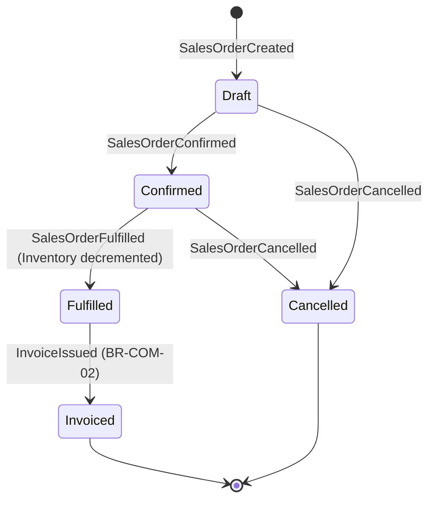
```mermaid
stateDiagram-v2
  [*] --> Draft: SalesOrderCreated
  Draft --> Confirmed: SalesOrderConfirmed
  Confirmed --> Fulfilled: SalesOrderFulfilled (Inventory decremented)
  Fulfilled --> Invoiced: InvoiceIssued (BR-COM-02)
  Draft --> Cancelled: SalesOrderCancelled
  Confirmed --> Cancelled: SalesOrderCancelled
  Invoiced --> [*]
  Cancelled --> [*]
```

## Invoice Lifecycle

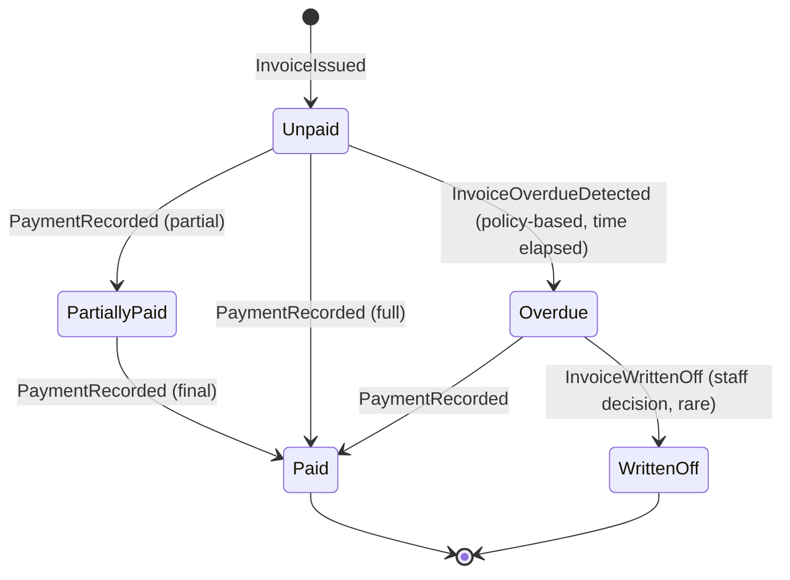
```mermaid
stateDiagram-v2
  [*] --> Unpaid: InvoiceIssued
  Unpaid --> PartiallyPaid: PaymentRecorded (partial)
  PartiallyPaid --> Paid: PaymentRecorded (final)
  Unpaid --> Paid: PaymentRecorded (full)
  Unpaid --> Overdue: InvoiceOverdueDetected (policy-based, time elapsed)
  Overdue --> Paid: PaymentRecorded
  Overdue --> WrittenOff: InvoiceWrittenOff (staff decision, rare)
  Paid --> [*]
  WrittenOff --> [*]
```

*Note*: BR-COM-05 — none of these states ever block Domain 3 from
recording new care for the Customer's Animal.

## PurchaseOrder Lifecycle

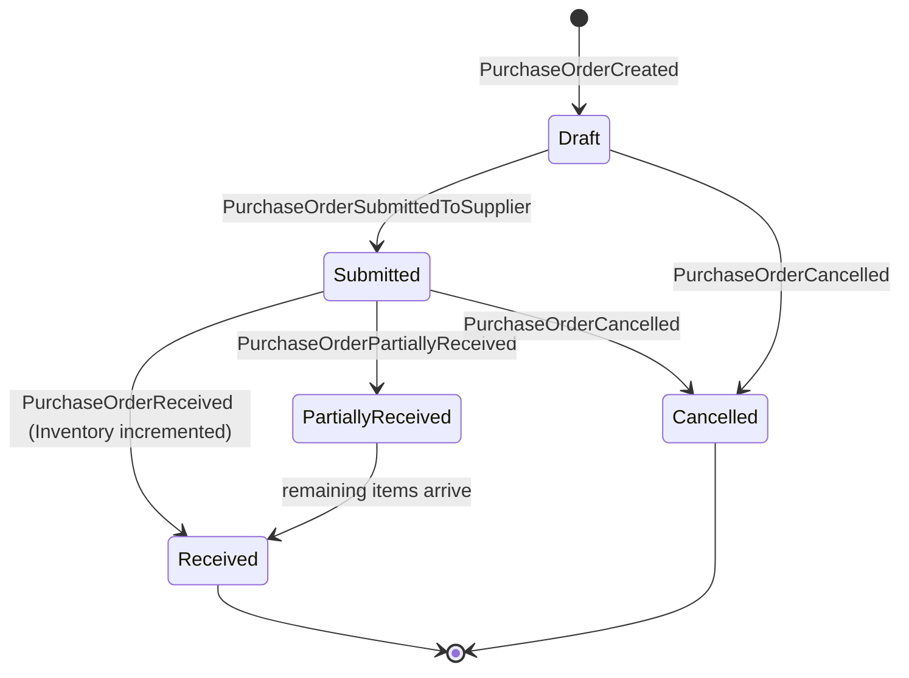
```mermaid
stateDiagram-v2
  [*] --> Draft: PurchaseOrderCreated
  Draft --> Submitted: PurchaseOrderSubmittedToSupplier
  Submitted --> Received: PurchaseOrderReceived (Inventory incremented)
  Submitted --> PartiallyReceived: PurchaseOrderPartiallyReceived
  PartiallyReceived --> Received: remaining items arrive
  Draft --> Cancelled: PurchaseOrderCancelled
  Submitted --> Cancelled: PurchaseOrderCancelled
  Received --> [*]
  Cancelled --> [*]
```

## Doctor / Employee / Dealer Lifecycle

All three share the same shape (they each wrap one `User`):

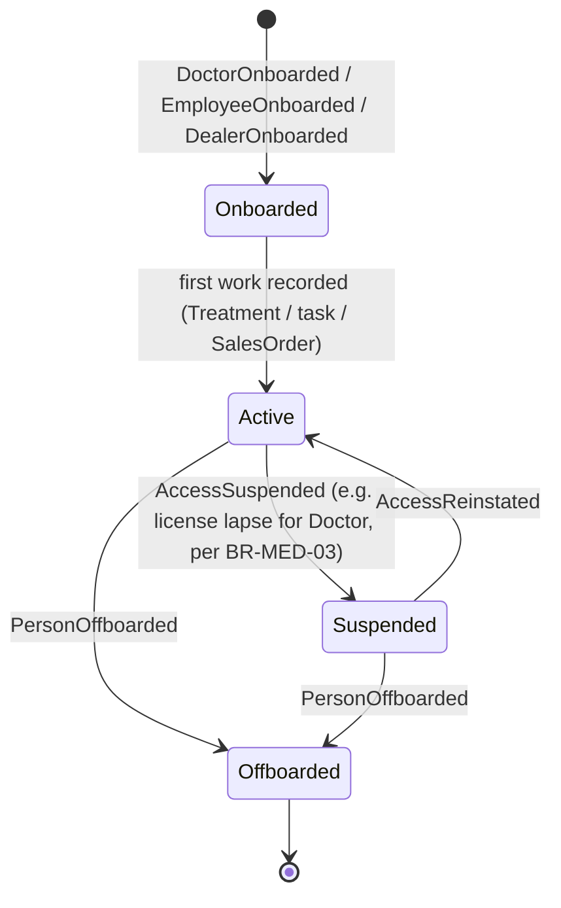
```mermaid
stateDiagram-v2
  [*] --> Onboarded: DoctorOnboarded / EmployeeOnboarded / DealerOnboarded
  Onboarded --> Active: first work recorded (Treatment / task / SalesOrder)
  Active --> Suspended: AccessSuspended (e.g. license lapse for Doctor, per BR-MED-03)
  Suspended --> Active: AccessReinstated
  Active --> Offboarded: PersonOffboarded
  Suspended --> Offboarded: PersonOffboarded
  Offboarded --> [*]
```

## AIConversation Lifecycle

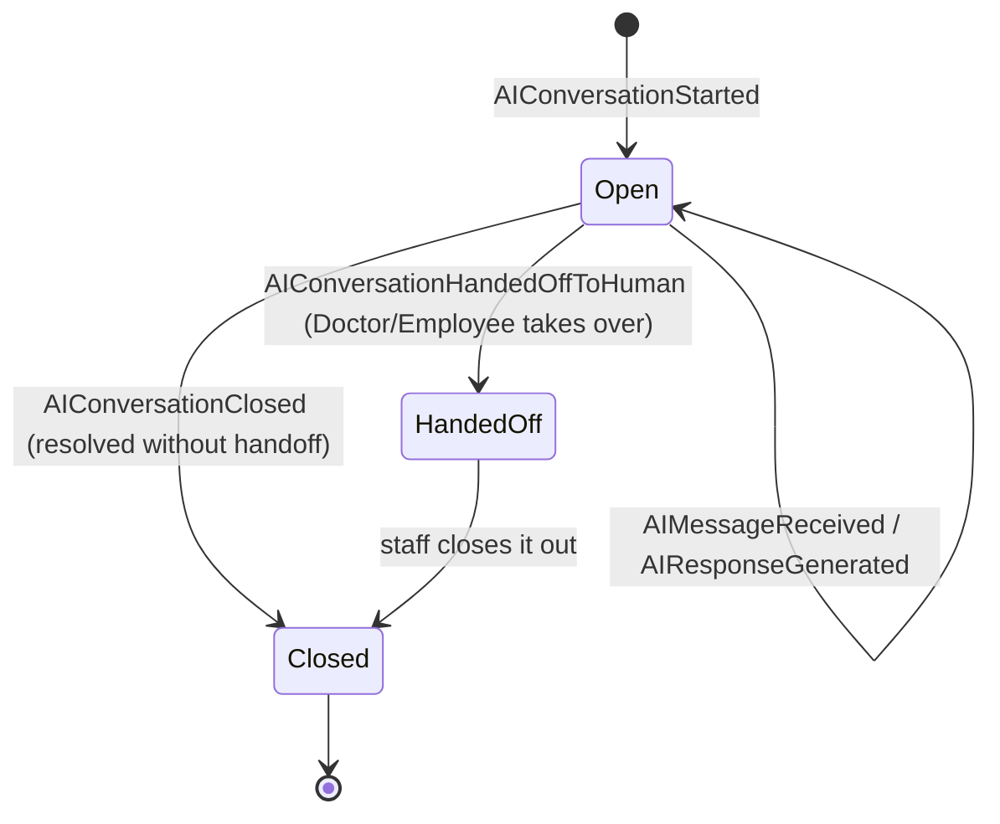
```mermaid
stateDiagram-v2
  [*] --> Open: AIConversationStarted
  Open --> Open: AIMessageReceived / AIResponseGenerated
  Open --> HandedOff: AIConversationHandedOffToHuman (Doctor/Employee takes over)
  Open --> Closed: AIConversationClosed (resolved without handoff)
  HandedOff --> Closed: staff closes it out
  Closed --> [*]
```

## AIRecommendation Lifecycle

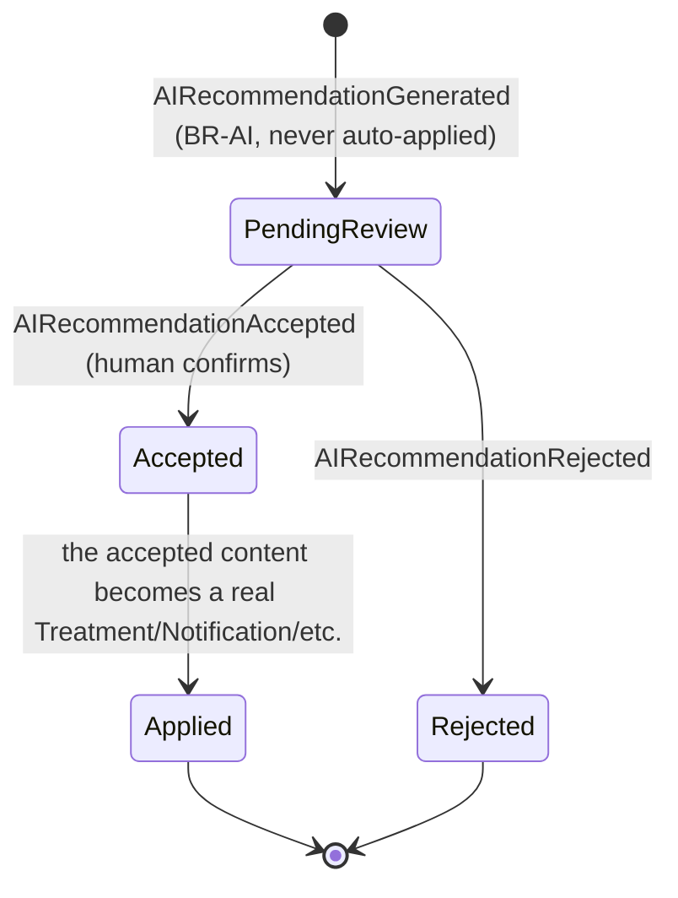
```mermaid
stateDiagram-v2
  [*] --> PendingReview: AIRecommendationGenerated (BR-AI, never auto-applied)
  PendingReview --> Accepted: AIRecommendationAccepted (human confirms)
  PendingReview --> Rejected: AIRecommendationRejected
  Accepted --> Applied: the accepted content becomes a real Treatment/Notification/etc.
  Applied --> [*]
  Rejected --> [*]
```

## AIMemory Lifecycle

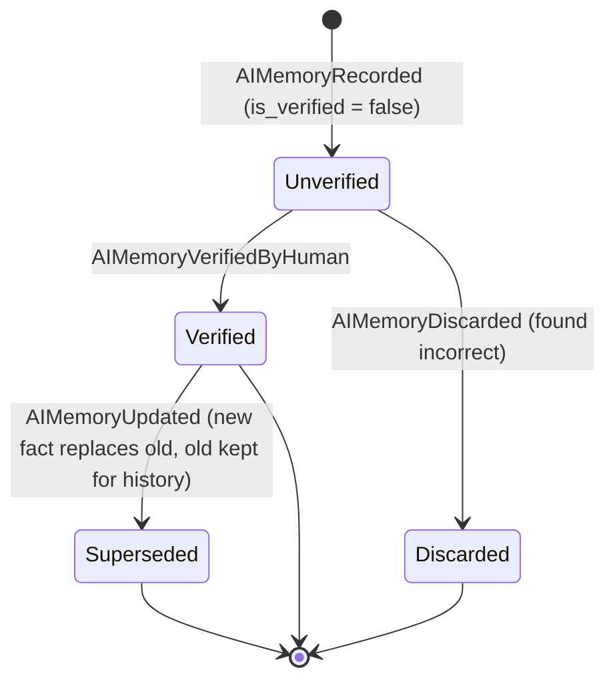
```mermaid
stateDiagram-v2
  [*] --> Unverified: AIMemoryRecorded (is_verified = false)
  Unverified --> Verified: AIMemoryVerifiedByHuman
  Unverified --> Discarded: AIMemoryDiscarded (found incorrect)
  Verified --> Superseded: AIMemoryUpdated (new fact replaces old, old kept for history)
  Verified --> [*]
  Discarded --> [*]
  Superseded --> [*]
```

## Notification Lifecycle

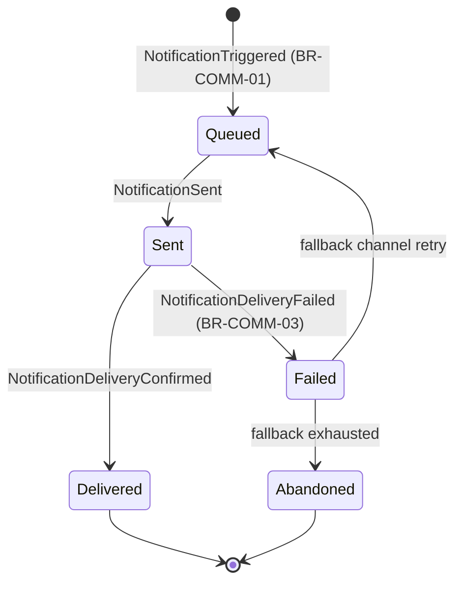
```mermaid
stateDiagram-v2
  [*] --> Queued: NotificationTriggered (BR-COMM-01)
  Queued --> Sent: NotificationSent
  Sent --> Delivered: NotificationDeliveryConfirmed
  Sent --> Failed: NotificationDeliveryFailed (BR-COMM-03)
  Failed --> Queued: fallback channel retry
  Delivered --> [*]
  Failed --> Abandoned: fallback exhausted
  Abandoned --> [*]
```

## DomainEvent (Timeline) — deliberately has no lifecycle

As stated in `26_DOMAIN_MODEL.md` Domain 8 §5: a `DomainEvent`, once
recorded, has exactly one state forever (`Recorded`). It is the one
aggregate in this catalog with no state diagram, because a state diagram
implies transitions, and BR-TL-01 forbids any transition away from
"recorded" ever happening.

## File liên quan

- Aggregates these lifecycles belong to: [`26_DOMAIN_MODEL.md`](./26_DOMAIN_MODEL.md)
- Rules constraining these transitions: [`27_BUSINESS_RULES.md`](./27_BUSINESS_RULES.md)
- Full event catalog + Event Storming: [`29_DOMAIN_EVENTS.md`](./29_DOMAIN_EVENTS.md)
