# 29. Domain Events Catalog + Event Storming

> Every event named in [`28_CRM_LIFECYCLE.md`](./28_CRM_LIFECYCLE.md),
> collected in one place with what data it carries and who/what consumes
> it, plus an Event Storming diagram tying them together along the
> VETJOY CARE 5 narrative spine. This is the concrete shape the `events`
> table (approved in Sprint 1 Revision, see
> `11_DATABASE_ARCHITECTURE.md`) will eventually store — but this
> document specifies the **business event catalog**, not the table DDL.

## Event naming convention

All events are named in past tense (something that *has already
happened* — a core DDD/event-sourcing discipline: events are facts, not
requests). Format: `<Aggregate><WhatHappened>`.

## Event catalog by domain

### Domain 1 — Customer

| Event | Carries | Consumed by |
| --- | --- | --- |
| `LeadCaptured` | source form, UTM data, contact info | Customer (on conversion), Communication |
| `CustomerRegistered` | customer id, originating lead id (BR-CUST-02), organization id | Timeline, Communication (welcome message) |
| `CustomerReassignedToDealer` | customer id, old/new dealer id | Timeline, Relationship |
| `CustomerArchived` | customer id, reason | Timeline |

### Domain 2 — Animal

| Event | Carries | Consumed by |
| --- | --- | --- |
| `AnimalRegistered` | animal id, species/breed, owner id | Timeline, AI (seed memory) |
| `AnimalTransferredToNewOwner` | animal id, old/new owner id | Timeline (Owner History projection source) |
| `AnimalMovedToFarm` | animal id, old/new farm id | Timeline (Farm History projection source) |
| `AnimalDeceasedRecorded` | animal id, date, recorded by | Timeline, Communication (condolence policy, handled with care) |
| `AnimalArchived` | animal id, reason | Timeline |

### Domain 3 — Medical

| Event | Carries | Consumed by |
| --- | --- | --- |
| `AppointmentRequested` / `Confirmed` / `Cancelled` / `Completed` / `NoShow` | appointment id, animal id, doctor id, time | Timeline, Communication (reminders) |
| `TreatmentStarted` | treatment id, animal id, doctor id | Timeline |
| `AssessmentRecorded` | treatment id, findings (CARE 5 step 2) | Timeline, AI (context for future recommendations) |
| `CarePlanRecorded` | treatment id, plan detail (CARE 5 step 3) | Timeline, Communication (send plan to Customer) |
| `TreatmentFinalized` | treatment id | Timeline, AI (candidate for AIMemory) |
| `TreatmentAmended` | original treatment id, correction, reason | Timeline (never replaces original event) |
| `PrescriptionIssued` / `Dispensed` / `CourseCompleted` / `Cancelled` | prescription id, treatment id, product lines | Timeline, Commerce (Inventory decrement) |
| `VaccinationAdministered` | vaccination id, animal id, product id, doctor id | Timeline, Commerce (Inventory decrement) |
| `VaccinationCorrectionRecorded` | original vaccination id, correction | Timeline |
| `LabTestOrdered` / `Resulted` / `Cancelled` / `ReviewedByDoctor` **(new — BR-MED-10)** | animal id, panel, result | Timeline, AI |

### Domain 4 — Commerce

| Event | Carries | Consumed by |
| --- | --- | --- |
| `SalesOrderCreated` / `Confirmed` / `Fulfilled` / `Cancelled` | order id, customer id, line items | Timeline, Commerce (Inventory) |
| `InvoiceIssued` | invoice id, order id, amount | Timeline, Communication |
| `PaymentRecorded` | invoice id, amount, partial/full | Timeline |
| `InvoiceOverdueDetected` | invoice id | Communication (reminder), never Medical (BR-COM-05) |
| `InvoiceWrittenOff` | invoice id, reason | Timeline |
| `PurchaseOrderCreated` / `SubmittedToSupplier` / `Received` / `PartiallyReceived` / `Cancelled` | PO id, supplier id, line items | Timeline, Commerce (Inventory increment) |
| `ProductSold` / `ProductAdministeredInVaccination` / `ProductDispensedInPrescription` | product id, quantity, source aggregate id | Commerce (Inventory decrement, BR-COM-03) |

### Domain 5 — Relationship

| Event | Carries | Consumed by |
| --- | --- | --- |
| `DoctorOnboarded` / `EmployeeOnboarded` / `DealerOnboarded` | person id, user id, organization id | Timeline, Identity & Access |
| `AccessSuspended` / `AccessReinstated` | person id, reason | Timeline, Identity & Access |
| `PersonOffboarded` | person id, reason | Timeline, Identity & Access |

### Domain 6 — AI

| Event | Carries | Consumed by |
| --- | --- | --- |
| `AIConversationStarted` / `AIMessageReceived` / `AIResponseGenerated` | conversation id, participant, message | Timeline |
| `AIConversationHandedOffToHuman` | conversation id, target doctor/employee | Communication, Relationship |
| `AIConversationClosed` | conversation id, resolution | Timeline |
| `AIRecommendationGenerated` | recommendation id, target, proposed content | Timeline (never auto-applied, BR-AI) |
| `AIRecommendationAccepted` / `Rejected` | recommendation id, human decision | Timeline, target domain (Medical/Commerce) |
| `AIMemoryRecorded` | memory id, subject, fact, is_verified=false | Timeline |
| `AIMemoryVerifiedByHuman` / `Discarded` / `Updated` | memory id, verifier | Timeline |

### Domain 7 — Communication

| Event | Carries | Consumed by |
| --- | --- | --- |
| `NotificationTriggered` | source event, recipient, content | Communication |
| `NotificationSent` / `DeliveryConfirmed` / `DeliveryFailed` | notification id, channel | Timeline |

### Domain 8 — Timeline

Timeline has no events of its own — it is the **consumer of record** for
every event listed above. Its only "event" is the structural fact that
every event above is written to the append-only stream (BR-TL-01/02).

## Event Storming diagram

Color legend (standard Event Storming palette): **orange** = Domain
Event, **blue** = Command, **yellow** = Aggregate, **purple** = Policy
(automatic reaction to an event), **green** = Read Model/Projection,
**pink** = External System. Laid out along the VETJOY CARE 5 narrative
spine (see [`33_VETJOY_CARE5_MAPPING.md`](./33_VETJOY_CARE5_MAPPING.md)
for the full mapping).

```mermaid
flowchart LR
  classDef command fill:#4a7fd6,color:#fff
  classDef event fill:#e08a2e,color:#fff
  classDef aggregate fill:#e0c62e,color:#000
  classDef policy fill:#8a4ad6,color:#fff
  classDef readmodel fill:#4ad68a,color:#000
  classDef external fill:#d64a9e,color:#fff

  C1[Ghi nhận Encounter]:::command --> A1[Treatment]:::aggregate
  A1 --> E1[TreatmentStarted]:::event
  E1 --> E2[AssessmentRecorded]:::event

  C2[Đánh giá / Assess]:::command --> A1
  A1 --> E2

  C3[Ghi Giải pháp / Care Plan]:::command --> A1
  A1 --> E3[CarePlanRecorded]:::event
  E3 --> P1{{Policy: notify Customer of plan}}:::policy
  P1 --> Notif[Notification]:::aggregate
  Notif --> E4[NotificationSent]:::event
  E4 --> Ext1[[Zalo / SMS / Email provider]]:::external

  E3 --> E5[TreatmentFinalized]:::event
  E5 --> P2{{Policy: candidate fact for AI memory}}:::policy
  P2 --> AIM[AIMemory]:::aggregate
  AIM --> E6[AIMemoryRecorded]:::event

  E5 --> P3{{Policy: Care Plan recommends follow-up}}:::policy
  P3 --> C4[Đặt lịch tái khám]:::command
  C4 --> Appt[Appointment]:::aggregate
  Appt --> E7[AppointmentRequested]:::event

  E7 --> P4{{Policy: reminder scheduling — Theo dõi}}:::policy
  P4 --> Notif

  E5 --> R1[/Animal Health Record projection/]:::readmodel
  E5 --> R2[/Animal Timeline projection/]:::readmodel
  E3 --> Presc[Prescription]:::aggregate
  Presc --> E8[PrescriptionIssued]:::event
  E8 --> P5{{Policy: decrement Inventory}}:::policy
  P5 --> Inv[Inventory]:::aggregate
  Inv --> E9[ProductDispensedInPrescription]:::event

  E1 -.-> R2
  E4 -.-> R2
  E6 -.-> R2
  E7 -.-> R2
  E9 -.-> R2

  R2 --> AIRead[[AI reads Timeline as context — Open Host Service]]:::external
  AIRead --> ARec[AIRecommendation]:::aggregate
  ARec --> E10[AIRecommendationGenerated]:::event
  E10 --> C5[Human reviews recommendation]:::command
  C5 --> E11[AIRecommendationAccepted]:::event
  E11 --> P6{{Policy: Anti-Corruption Layer — apply only after human accept}}:::policy
  P6 --> A1
```

**How to read this**: the spine runs left-to-right through one VETJOY
CARE 5 encounter (Ghi nhận → Đánh giá → Giải pháp), fans out into the
policies each finalized Treatment triggers (notify, remember, schedule
follow-up, consume inventory), and shows every event feeding the Animal
Timeline projection (dotted lines) — visually demonstrating BR-TL-02
("every domain publishes events the Timeline can consume") and BR-TL-03
("Timeline is a read-only projection, not a separate source of truth").
The AI loop at the bottom shows the Anti-Corruption Layer concretely:
`AIRecommendationGenerated` cannot reach the `Treatment` aggregate except
through a human "accept" command — this is the mechanism, not just the
policy, behind BR-MED-04/BR-AI's "no auto-applied AI content" rule.

## File liên quan

- Lifecycles these events transition: [`28_CRM_LIFECYCLE.md`](./28_CRM_LIFECYCLE.md)
- Rules these events must honor: [`27_BUSINESS_RULES.md`](./27_BUSINESS_RULES.md)
- AI-specific event detail: [`30_AI_DOMAIN.md`](./30_AI_DOMAIN.md)
- VETJOY CARE 5 narrative this diagram follows: [`33_VETJOY_CARE5_MAPPING.md`](./33_VETJOY_CARE5_MAPPING.md)
- Approved `events` table this will eventually be persisted as: [`11_DATABASE_ARCHITECTURE.md`](./11_DATABASE_ARCHITECTURE.md)
