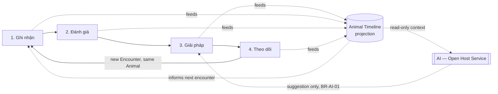

# 33. VETJOY CARE 5 → DDD Mapping

> Maps VETJOY's proprietary 5-step care methodology — **Ghi nhận → Đánh
> giá → Giải pháp → Theo dõi → Chăm sóc tiếp** (Record → Assess → Solve →
> Follow up → Continue care), established in the original Phase 1 brand
> brief — onto the DDD Aggregates, Commands, and Domain Events defined in
> [`26_DOMAIN_MODEL.md`](./26_DOMAIN_MODEL.md) through
> [`29_DOMAIN_EVENTS.md`](./29_DOMAIN_EVENTS.md). This closes the loop
> the brief asked for: VETJOY CARE 5 is not just marketing language, it
> is now traceable to concrete domain behavior.

## Why this mapping matters

VETJOY CARE 5 is the business's actual claimed differentiator (per
`06_CONTENT_GUIDE.md` and the site's `/ve-vetjoy` and homepage content).
If this methodology only exists as marketing copy and doesn't correspond
to anything the eventual CRM software actually enforces or supports, the
brand promise and the product would drift apart over time. This mapping
is what keeps them aligned as Sprint 2+ eventually builds real code.

## The five steps, mapped

### 1. Ghi nhận (Record)

| DDD element | Value |
| --- | --- |
| Primary Aggregate | `Treatment` (Domain 3), plus the `Appointment` it may originate from |
| Command | "Bắt đầu khám" (start Encounter) |
| Event(s) | `TreatmentStarted` |
| Business Rule | BR-MED-01 (must reference an Animal), BR-MED-03 (Doctor must be licensed) |
| What's actually recorded | Chief complaint, presenting symptoms, animal identity confirmation |

This step is the entry point of every Medical domain interaction — it is
deliberately the *first* thing that happens, before any assessment or
conclusion, matching the brand promise that VETJOY listens/documents
before it acts.

### 2. Đánh giá (Assess)

| DDD element | Value |
| --- | --- |
| Primary Aggregate | `Treatment` (same aggregate, next state) |
| Command | "Ghi đánh giá lâm sàng" (record clinical assessment) |
| Event(s) | `AssessmentRecorded` |
| Business Rule | BR-MED-04 (no auto-generated diagnosis — a Doctor authors this) |
| What's actually recorded | Clinical findings, differential considerations, any `LabTest` ordered to support the assessment (`LabTestOrdered`) |

This is the step where Domain 6 (AI) may contribute *context* (prior
Health Record, similar past cases) via its Open Host Service read access
— but per BR-AI-03, the assessment itself is always Doctor-authored.

### 3. Giải pháp (Solution / Care Plan)

| DDD element | Value |
| --- | --- |
| Primary Aggregate | `Treatment` (finalization), often producing `Prescription` and/or `Vaccination` |
| Command | "Ghi giải pháp / kế hoạch chăm sóc" |
| Event(s) | `CarePlanRecorded`, `TreatmentFinalized`, optionally `PrescriptionIssued`, `VaccinationAdministered` |
| Business Rule | BR-MED-02 (Prescription only within/after a Treatment), BR-COM-05 (never gated by unpaid Invoice), BR-MED-08 (never adjusted to justify a sale) |
| What's actually recorded | The concrete plan: medication, dosage instructions, next steps |
| Policy triggered | Notify Customer of the Care Plan (`29_DOMAIN_EVENTS.md` Event Storming diagram); candidate fact recorded to `AIMemory` if notable (e.g. an allergy) |

This is the step the brand promise "không chỉ bán thuốc" (not just
selling medicine) is really about — the Care Plan is the deliverable,
of which a Prescription is only one possible component, never the whole
point.

### 4. Theo dõi (Follow-up)

| DDD element | Value |
| --- | --- |
| Primary Aggregate | A new `Appointment` (referencing the prior `Treatment`), and `Notification` (Domain 7) |
| Command | "Đặt lịch tái khám" (schedule follow-up), "Gửi nhắc lịch" (send reminder) |
| Event(s) | `AppointmentRequested`/`Confirmed`, `NotificationTriggered`/`Sent` |
| Business Rule | BR-MED-09 (follow-up scheduling is always an explicit action, never automatic), BR-COMM-02 (channel respects Customer preference) |
| What's actually recorded | Follow-up timing, reminder delivery status |

This step is where Domain 3 and Domain 7 (Communication) cooperate —
Medical decides *that* a follow-up matters, Communication decides *how*
to remind the Customer about it.

### 5. Chăm sóc tiếp (Continued care)

| DDD element | Value |
| --- | --- |
| Primary Aggregate | The next `Treatment` in the same Animal's history — i.e., this step *is* the loop returning to step 1 |
| Command | (none new — this is the recurrence of "Ghi nhận" for the next encounter) |
| Event(s) | Cumulative: every prior event now visible in the Animal's Health Record/Timeline projection (`32_ANIMAL_HEALTH_RECORD.md`), informing this next encounter |
| Business Rule | BR-TL-02/03 (every event feeds Timeline; Timeline is read-only projection) |
| What's actually recorded | Nothing new by itself — this step's entire value is that steps 1–4 accumulate into a queryable history that makes *this* encounter better-informed than the last |

**This is the step that most depends on the Domain 2 design decision in
`32_ANIMAL_HEALTH_RECORD.md`** (History as Projection, not Field): "Chăm
sóc tiếp" is only possible as a genuine differentiator — not just a
slogan — if a Doctor starting a *new* Encounter can actually see the
Animal's full accumulated Health Record/Timeline instantly. That is
exactly what the Timeline projection is built to provide.

## The loop, visually

## Where AI fits into VETJOY CARE 5 (explicit, since it's easy to get
wrong)

AI (Domain 6) is not a 6th step and does not replace any of the 5 —
it is a **cross-cutting reader** that can make steps 2–4 faster/better
informed (surfacing relevant Timeline history, drafting a Care Plan
notification, suggesting a follow-up reminder) but per BR-AI-01/03/04,
never authors step 2 or 3's actual clinical content and never
auto-executes step 4's scheduling without a human command. VETJOY CARE 5
remains a human-delivered methodology; AI augments it, per the Purpose
statement in `30_AI_DOMAIN.md`.

## File liên quan

- Domain model: [`26_DOMAIN_MODEL.md`](./26_DOMAIN_MODEL.md)
- Business rules referenced throughout: [`27_BUSINESS_RULES.md`](./27_BUSINESS_RULES.md)
- Treatment lifecycle this mapping walks through: [`28_CRM_LIFECYCLE.md`](./28_CRM_LIFECYCLE.md)
- Full event catalog and Event Storming diagram: [`29_DOMAIN_EVENTS.md`](./29_DOMAIN_EVENTS.md)
- AI's role in this loop: [`30_AI_DOMAIN.md`](./30_AI_DOMAIN.md)
- Why Timeline/History is a projection: [`32_ANIMAL_HEALTH_RECORD.md`](./32_ANIMAL_HEALTH_RECORD.md)
- Original VETJOY CARE 5 brand definition: [`01_PROJECT_OVERVIEW.md`](./01_PROJECT_OVERVIEW.md)
