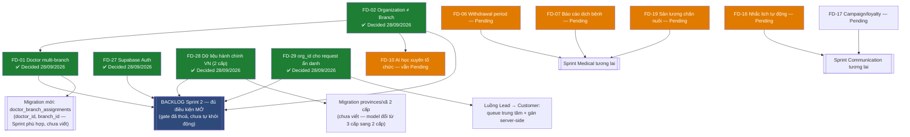

# 40. Founder Decisions Lock

> **Sprint 2.2 — Consolidation Sprint, not a Design Sprint.** This
> document does not introduce any new Business Rule, Domain, or
> architecture decision. It reads every decision point that has
> surfaced across `01_PROJECT_OVERVIEW.md` through
> `39_FOUNDER_DECISIONS.md` and locks them into one registry.
>
> **What "lock" means from this point forward**: once Founder marks a
> decision **Decided** here, it becomes as immutable as an approved
> migration (`21_GOVERNANCE.md` Rule 1) — a future Sprint may not
> silently reinterpret it. Changing a locked decision requires the same
> discipline as changing an approved migration: an explicit new decision
> entry referencing and superseding this one, never a quiet edit.
> Decisions still marked **Pending** below are exactly what block or
> don't block Sprint 3 — see the Nhóm (Group) assigned to each.
>
> **Cập nhật 28/09/2026**: toàn bộ 5 quyết định Nhóm A (FD-01, FD-02,
> FD-27, FD-28, FD-29) đã được Founder phê duyệt và khoá — xem chi tiết
> trong từng mục bên dưới và trong
> [`41_ARCHITECTURE_DECISIONS.md`](./41_ARCHITECTURE_DECISIONS.md)
> (ADR-13 đến ADR-17).

## How decisions were gathered

Every prior Sprint's own documents were re-read for explicit Founder
decision points:
- Sprint 2.1's own consolidated list (`39_FOUNDER_DECISIONS.md`, 26
  items, renumbered FD-01…FD-26 below in the same order).
- Phase 1/2 operational planning docs (`07_DEPLOYMENT.md`,
  `09_PHASE2_PLAN.md`) — hosting/domain, Supabase budget, CMS approach,
  AI vendor, automation tooling, analytics provider (FD-30…FD-36).
- `BACKLOG_PHASE2.md`'s own still-open "Quyết định Founder vẫn cần chốt"
  list from Sprint 1 Revision, never formally closed out (FD-27…FD-29).

## Nhóm (Group) definitions

- **Nhóm A** — bắt buộc quyết định ngay; nếu không quyết định thì Sprint
  3 (kiến trúc/migration tiếp theo) không được mở.
- **Nhóm B** — có giá trị mặc định an toàn ngay bây giờ; đổi sau bằng
  một migration mới (không cần dừng lại chờ, theo đúng
  `23_MIGRATION_POLICY.md` — sửa đổi luôn là migration mới, không sửa
  migration cũ).
- **Nhóm C** — để Phase 3/Phase 4; không cần thiết cho việc vận hành CRM
  cơ bản của Phase 2.

## Founder Dashboard

| ID | Decision | Nhóm | Priority | Status |
| --- | --- | --- | --- | --- |
| FD-01 | Doctor đa chi nhánh (multi-branch, cùng một Organization) | A | Critical | **Decided (28/09/2026)** |
| FD-02 | Mô hình `organizations`: nhiều chi nhánh VETJOY hay SaaS đa công ty | A | Critical | **Decided (28/09/2026)** |
| FD-27 | Xác nhận dùng Supabase Auth cho `users` | A | Critical | **Decided (28/09/2026)** |
| FD-28 | Nguồn dữ liệu hành chính VN (provinces/districts/communes) | A | Critical | **Decided (28/09/2026)** |
| FD-29 | Cơ chế `organization_id` cho request ẩn danh (website public) | A | Critical | **Decided (28/09/2026)** |
| FD-06 | Theo dõi thời gian ngưng thuốc (withdrawal period) | B | Critical | Pending |
| FD-07 | Báo cáo dịch bệnh bắt buộc cho cơ quan thú y | B | Critical | Pending |
| FD-08 | Quyền xoá/xuất dữ liệu khách hàng | B | Critical | Pending |
| FD-04 | Cơ chế xác minh giấy phép hành nghề bác sĩ | B | High | Pending |
| FD-05 | Chính sách công nợ/thu hồi nợ | B | High | Pending |
| FD-30 | Ngân sách Supabase (tier trả phí) | B | High | Pending |
| FD-16 | Nhắc lịch tự động vs. BR-MED-09 | B | High | Pending |
| FD-19 | Theo dõi sản lượng chăn nuôi (heo/bò/gia cầm) | B | High | Pending |
| FD-03 | Timeline: khu vực sản phẩm riêng hay hạ tầng dùng chung | B | Medium | Pending |
| FD-13 | Tính năng case/ticket hỗ trợ khách hàng | B | Medium | Pending |
| FD-14 | Sales pipeline cho khách hàng B2B/đại lý | B | Medium | Pending |
| FD-15 | Thu thập phản hồi/đánh giá khách hàng (CSAT) | B | Medium | Pending |
| FD-17 | Chiến dịch marketing / chương trình khách hàng thân thiết | B | Medium | Pending |
| FD-18 | Dự báo khách hàng có nguy cơ rời bỏ (chủ động) | B | Medium | Pending |
| FD-20 | Theo dõi phối giống/sinh sản vật nuôi | B | Medium | Pending |
| FD-21 | Chứng nhận tiêm phòng (ví dụ: dại) dạng tài liệu chia sẻ được | B | Medium | Pending |
| FD-22 | Dịch vụ phi y tế (grooming/lưu trú) | B | Medium | Pending |
| FD-23 | Phân biệt an tử và tử vong tự nhiên | B | Medium | Pending |
| FD-31 | Hướng CMS (mua sẵn hay tự xây trên Supabase) | B | Medium | Pending |
| FD-32 | Nền tảng hosting + domain chính thức | B | Medium | Pending |
| FD-33 | Nhà cung cấp Analytics (GA/Plausible/PostHog) | B | Medium | Pending |
| FD-34 | Giải pháp job nền cho reminders | B | Medium | Pending |
| FD-09 | Sự đồng ý dùng dữ liệu khách hàng để huấn luyện AI | C | Low | Pending |
| FD-10 | AI học mẫu hình xuyên tổ chức (population-level) | C | Low | Pending |
| FD-11 | Đầu tư xây từ vựng y khoa có cấu trúc cho AI | C | Low | Pending |
| FD-12 | Năng lực báo cáo/phân tích (Reporting/Analytics) | C | Low | Pending |
| FD-24 | Lộ trình tích hợp cảm biến IoT trang trại | C | Low | Pending |
| FD-25 | Lộ trình giám sát bằng camera/AI Vision | C | Low | Pending |
| FD-26 | Cho phép máy móc tự động thực hiện hành vi y tế (Robot) | C | Low | Pending |
| FD-35 | Nhà cung cấp LLM/API Gateway cho AI Assistant | C | Low | Pending |
| FD-36 | Công cụ automation (Lead → CRM → Zalo/Email) | C | Low | Pending |

**36 quyết định tổng cộng — 8 Critical · 5 High · 14 Medium · 9 Low.**

> **Cập nhật 28/09/2026**: 5 quyết định Nhóm A (FD-01, FD-02, FD-27,
> FD-28, FD-29) đã được Founder phê duyệt và chuyển từ **Pending** sang
> **Decided**. Nội dung "Vấn đề/Lựa chọn/Ưu nhược điểm/Khuyến nghị" bên
> dưới được **giữ nguyên làm hồ sơ lịch sử** (đúng theo tinh thần "một
> quyết định chỉ đổi bằng một quyết định mới, không sửa trực tiếp" của
> Điều khoản khoá) — mỗi mục có thêm khối **"Quyết định của Founder
> (28/09/2026)"** ghi nội dung đã chốt, đây là phần có hiệu lực áp dụng
> từ nay trở đi, không phải phần "Khuyến nghị của Claude" phía trên nó.

---

## Nhóm A — Đã quyết định (28/09/2026)

### FD-01. Doctor đa chi nhánh (multi-branch, cùng một Organization)

**Vấn đề**: Business rule Sprint 2.0 (BR-REL-05) giả định một Doctor có
thể làm việc ở nhiều chi nhánh cùng lúc. Migration đã đóng băng ở Sprint
1.5 (`users.organization_id not null`) chỉ cho phép một user thuộc đúng
một tổ chức. Hai điều này không thể cùng đúng.

**Các lựa chọn**:
- (A) Sửa BR-REL-05: mỗi Doctor chỉ thuộc một tổ chức, muốn làm ở chi
  nhánh khác phải có tài khoản `User` riêng cho mỗi chi nhánh.
- (B) Giữ BR-REL-05, viết migration mới (Sprint tương lai) thêm bảng
  nối nhiều-nhiều `doctor_branch_assignments`, không đổi migration đã
  đóng băng.

**Ưu điểm / Nhược điểm**:
- (A) Ưu điểm: không cần migration mới, triển khai ngay được ở Sprint
  3. Nhược điểm: một bác sĩ làm ở 2 chi nhánh phải đăng nhập 2 tài
  khoản khác nhau — trải nghiệm kém, dữ liệu lịch sử của họ bị chia
  cắt theo tài khoản.
- (B) Ưu điểm: đúng với thực tế vận hành (bác sĩ thỉnh giảng/luân
  chuyển). Nhược điểm: cần thêm 1 Sprint migration riêng trước khi
  Domain 5 hoàn thiện; phức tạp hơn cho RLS (một user nhìn thấy dữ
  liệu của nhiều tổ chức).

**Khuyến nghị của Claude**: (A) làm trước cho Sprint 3 (đơn giản, đúng
với dữ liệu đã có), ghi nhận (B) là nhu cầu thật và đưa vào backlog
migration riêng ngay khi có bác sĩ đa chi nhánh thật cần onboard —
không nên thiết kế RLS phức tạp cho một nhu cầu chưa xác nhận có khách
hàng thật cần.

**Ảnh hưởng**: Migration: **Có** — quyết định (B) cần migration mới;
AI: Không trực tiếp; CRM: **Có** — ảnh hưởng cách gán Doctor vào
Treatment/Appointment; Mobile App: Có — ảnh hưởng luồng đăng nhập bác
sĩ; Dashboard: Có — ảnh hưởng bộ lọc "chọn tổ chức đang làm việc".

**Quyết định của Founder (28/09/2026)** — chọn hướng lai giữa (A) và
(B), không phải nguyên văn một trong hai lựa chọn đã nêu:
- Mỗi bác sĩ chỉ có **một** tài khoản đăng nhập (không tạo nhiều tài
  khoản cho cùng một người, khác với khuyến nghị (A) ban đầu).
- Một bác sĩ **được phép** làm việc tại nhiều chi nhánh (giữ tinh thần
  BR-REL-05, khác với khuyến nghị ban đầu).
- Cơ chế: dùng **bảng liên kết nhiều-nhiều** tên `doctor_branch_assignments`
  giữa bác sĩ và **Branch** (không phải giữa bác sĩ và Organization —
  Organization và Branch là hai khái niệm khác nhau theo FD-02) —
  triển khai bằng **migration mới trong một Sprint phù hợp** (chưa viết
  trong nhiệm vụ này), không sửa migration đã đóng băng. Mô tả tối
  thiểu của bảng này:
  - `doctor_id` — tham chiếu Doctor (một bác sĩ có thể có **nhiều** bản
    ghi trong bảng này, mỗi bản ghi là một Branch).
  - `branch_id` — tham chiếu Branch mà bác sĩ được phân công làm việc.
  - **Ràng buộc bắt buộc**: Branch được gán phải thuộc **cùng một
    Organization** với tài khoản gốc (`users.organization_id`) của bác
    sĩ đó — **không cho phép** gán bác sĩ sang Branch thuộc một
    Organization khác. Vì Phase 2 chỉ có một Organization (VETJOY),
    ràng buộc này hiện luôn thoả tự động, nhưng phải được thiết kế
    tường minh (không giả định ngầm) để không vỡ khi có Organization
    thứ hai trong tương lai.
  - RLS trên bảng này (và trên dữ liệu Doctor truy cập) phải kiểm tra
    Organization **thông qua Branch** (`branch.organization_id`), không
    kiểm tra trực tiếp trên `doctor_id` một cách tách rời.
- Lịch sử chuyên môn, lịch khám và audit log của một bác sĩ **không**
  bị chia tách theo chi nhánh — vẫn là một hồ sơ thống nhất tham chiếu
  đúng một Doctor.
- Vì FD-02 (bên dưới) xác nhận Phase 2 chỉ có **một** Organization
  (VETJOY), "nhiều chi nhánh" ở đây là nhiều **Branch trong cùng một
  Organization** — không phải nhiều tenant. Điều này làm mối lo về RLS
  phức tạp (nêu ở mục Nhược điểm của (B) phía trên) giảm đáng kể: không
  cần thiết kế hiển thị dữ liệu chéo *tenant*, chỉ cần chéo *branch*
  trong cùng một tenant.
- `users.organization_id` (bảng đã đóng băng) tiếp tục là tổ chức
  "gốc"/đăng nhập của tài khoản — không đổi ý nghĩa, không đổi migration.

Xem [`41_ARCHITECTURE_DECISIONS.md`](./41_ARCHITECTURE_DECISIONS.md)
ADR-13 cho bản ghi kiến trúc đầy đủ.

---

### FD-02. Mô hình `organizations`: nhiều chi nhánh VETJOY hay SaaS đa công ty

**Vấn đề**: Đây là quyết định còn treo từ Sprint 1 Revision
(`BACKLOG_PHASE2.md` dòng "Quyết định Founder vẫn cần chốt trước khi mở
Sprint 1.5"), chưa từng được chốt chính thức qua 3 Sprint. Cấu trúc
bảng đã thiết kế dùng chung được cho cả hai hướng, nhưng cách đặt tên/
UX chọn tổ chức, và việc có cho phép một Customer thuộc nhiều
Organization hay không (FD liên quan trong `39_FOUNDER_DECISIONS.md`)
phụ thuộc hoàn toàn vào câu trả lời này.

**Các lựa chọn**:
- (A) Chỉ dùng cho các chi nhánh của VETJOY (một công ty, nhiều chi
  nhánh/phòng khám).
- (B) Nền tảng SaaS cho nhiều công ty thú y khác thuê dùng.
- (C) Cả hai, nhưng bắt đầu build/vận hành như (A), giữ khả năng mở
  rộng sang (B) sau.

**Ưu điểm / Nhược điểm**:
- (A) Ưu điểm: đơn giản, đúng nhu cầu trước mắt. Nhược điểm: giới hạn
  tiềm năng kinh doanh dài hạn nếu Founder có ý định SaaS.
- (B) Ưu điểm: mở ra mô hình kinh doanh mới (bán phần mềm cho đối thủ/
  đồng nghiệp ngành thú y). Nhược điểm: yêu cầu UX/pricing/support
  hoàn toàn khác, không nên bắt đầu ở quy mô này.
- (C) Ưu điểm: không đóng cửa tương lai, không phải trả giá phức tạp
  ngay. Nhược điểm: cần kỷ luật thiết kế (không hard-code giả định
  "chỉ VETJOY") ngay từ Sprint 3.

**Khuyến nghị của Claude**: (C) — vận hành như (A) nhưng đặt tên/API
theo hướng trung lập (đã đúng theo thiết kế `organizations` hiện tại),
tránh hard-code "VETJOY" ở bất kỳ đâu trong logic nghiệp vụ.

**Ảnh hưởng**: Migration: Không (cấu trúc bảng đã hỗ trợ cả hai);
AI: Có — ảnh hưởng trực tiếp tới FD-10 (học mẫu hình xuyên tổ chức)
vì SaaS đa công ty làm cho việc này nhạy cảm hơn nhiều; CRM: Có — ảnh
hưởng UX chọn tổ chức; Mobile App: Có; Dashboard: Có — ảnh hưởng cách
đặt tên khu vực chọn tổ chức.

**Quyết định của Founder (28/09/2026)** — chọn (C), có làm rõ thêm một
điểm quan trọng chưa nêu rõ ở bản phân tích ban đầu:
- Giai đoạn hiện tại **chỉ vận hành cho một Organization: VETJOY**.
  Chưa triển khai mô hình SaaS đa công ty.
- Kiến trúc và cách đặt tên phải **trung lập**, không hard-code
  "VETJOY" vào logic phân quyền hoặc cấu trúc dữ liệu, để có thể mở
  rộng thành SaaS sau này.
- **Phải tách rõ hai khái niệm, không còn dùng đồng nghĩa**:
  - **Organization** = công ty/tenant sở hữu dữ liệu. Hiện tại chỉ có
    một: VETJOY.
  - **Branch** = trụ sở hoặc chi nhánh **thuộc về** một Organization.
  Toàn bộ tài liệu trước đây (kể cả bản phân tích FD-01/FD-02 ở trên)
  dùng "organization" để chỉ cả hai khái niệm này — đây là điểm cần
  sửa thuật ngữ trong các tài liệu liên quan (xem danh sách trong báo
  cáo cuối), không sửa trong nhiệm vụ này.
- Phase 2 **chưa làm**: đăng ký công ty tự phục vụ, thanh toán thuê bao
  SaaS, quản trị nhiều công ty trên giao diện, tự động tạo tenant mới.

Xem [`41_ARCHITECTURE_DECISIONS.md`](./41_ARCHITECTURE_DECISIONS.md)
ADR-14 cho bản ghi kiến trúc đầy đủ.

---

### FD-27. Xác nhận dùng Supabase Auth cho `users`

**Vấn đề**: Migration đã đóng băng Sprint 1.5 định nghĩa bảng `users`
là "extending `auth.users`" — nghĩa là **đã ngầm giả định** dùng
Supabase Auth trực tiếp, dù đây vẫn là mục "chờ Founder xác nhận" nêu
trong `BACKLOG_PHASE2.md` từ Sprint 1 Revision. Quyết định trên thực tế
đã được đưa ra bởi thiết kế kỹ thuật trước khi Founder xác nhận rõ
ràng — cần xác nhận lại chính thức, không phải vì sai, mà vì chưa có
sign-off đúng quy trình.

**Các lựa chọn**:
- (A) Xác nhận dùng Supabase Auth trực tiếp (khớp với migration đã
  viết — không cần sửa gì).
- (B) Dùng hệ thống đăng nhập khác (ví dụ hệ thống công ty đã có sẵn),
  đồng bộ sang `auth.users`/`users` sau.

**Ưu điểm / Nhược điểm**:
- (A) Ưu điểm: không cần sửa migration đã duyệt, triển khai nhanh nhất.
  Nhược điểm: gắn chặt vào hệ sinh thái Supabase.
- (B) Ưu điểm: linh hoạt nếu VETJOY đã có hệ thống đăng nhập riêng.
  Nhược điểm: **phải viết migration mới** thay đổi cách `users` liên
  kết với danh tính — tốn thêm một Sprint, và (theo Rule 1) không được
  sửa migration cũ, phải làm lại từ đầu phần này.

**Khuyến nghị của Claude**: (A) — migration đã viết đúng theo hướng
này, dùng Supabase Auth là lựa chọn hợp lý và đỡ tốn công nhất; xác
nhận chính thức để không còn là quyết định ngầm định.

**Ảnh hưởng**: Migration: Có (nếu chọn B, cần thiết kế lại); AI: Không;
CRM: Không trực tiếp; Mobile App: Có — ảnh hưởng SDK đăng nhập dùng
trong app; Dashboard: Có — tương tự.

**Quyết định của Founder (28/09/2026)** — chọn (A), xác nhận chính
thức:
- Dùng **Supabase Auth** làm nguồn danh tính đăng nhập chính cho nhân
  viên, bác sĩ, đại lý và khách hàng có tài khoản.
- Không triển khai hệ thống đăng nhập thứ hai.
- Không thay đổi giả định "extends `auth.users`" đã có sẵn trong
  migration đóng băng — quyết định này xác nhận đúng những gì đã viết,
  không yêu cầu sửa gì.

Xem [`41_ARCHITECTURE_DECISIONS.md`](./41_ARCHITECTURE_DECISIONS.md)
ADR-15 cho bản ghi kiến trúc đầy đủ.

---

### FD-28. Nguồn dữ liệu hành chính VN chính thức (provinces/districts/communes)

**Vấn đề**: Vẫn là mục treo từ Sprint 1 Revision. Migration cho
`provinces`/`districts`/`communes` (Sprint 2 trong `BACKLOG_PHASE2.md`)
không thể viết seed data chính xác nếu chưa xác định nguồn dữ liệu nào
là "chính thức" (đặc biệt sau các đợt sáp nhập đơn vị hành chính — dữ
liệu cần luôn khớp với thực tế pháp lý hiện hành).

**Các lựa chọn**:
- (A) Dùng danh mục hành chính do Tổng cục Thống kê/Bộ Nội vụ công bố.
- (B) Dùng một thư viện/API địa chỉ VN có sẵn (ví dụ của bên thứ ba).
- (C) Founder/nhân viên tự nhập tay danh sách chi nhánh/khu vực phục vụ
  thực tế (không cần đầy đủ toàn quốc, chỉ nơi VETJOY có hoạt động).

**Ưu điểm / Nhược điểm**:
- (A) Ưu điểm: chính xác, có thẩm quyền. Nhược điểm: cần công sức
  chuẩn hoá dữ liệu thành seed SQL.
- (B) Ưu điểm: nhanh, ít công sức. Nhược điểm: phụ thuộc bên thứ ba,
  có thể lỗi thời sau sáp nhập hành chính.
- (C) Ưu điểm: nhanh nhất, đúng nhu cầu thực tế trước mắt. Nhược điểm:
  không đầy đủ nếu VETJOY mở rộng vùng phục vụ nhanh.

**Khuyến nghị của Claude**: (C) trước, (A) sau khi cần mở rộng toàn
quốc — không cần seed đầy đủ 63 tỉnh thành ngay khi VETJOY mới vận
hành ở một số khu vực.

**Ảnh hưởng**: Migration: Có — chặn migration Sprint 2 (theo
`BACKLOG_PHASE2.md`); AI: Không; CRM: Có — ảnh hưởng form địa chỉ
Customer/Farm; Mobile App: Có; Dashboard: Có.

**Quyết định của Founder (28/09/2026)** — chọn (A), với yêu cầu bổ
sung quan trọng làm thay đổi mô hình dữ liệu dự kiến so với bản phân
tích ban đầu:
- Dùng **danh mục hành chính chính thức do cơ quan nhà nước công bố**.
  Không phụ thuộc API bên thứ ba khi hệ thống đang chạy (runtime).
- Dữ liệu phải được **chuẩn hoá và lưu thành seed data có phiên bản**
  — bắt buộc lưu **nguồn dữ liệu, ngày hiệu lực, và phiên bản nhập**.
- **Mô hình hành chính đổi từ 3 cấp sang 2 cấp**, khác với giả định
  `provinces`/`districts`/`communes` (tỉnh/huyện/xã) hiện có trong
  `BACKLOG_PHASE2.md` và `12_SUPABASE_SCHEMA.md`:
  - Cấp tỉnh hoặc thành phố.
  - Cấp xã, phường hoặc đặc khu.
  - Địa chỉ chi tiết.
  - **Không bắt buộc cấp huyện** trong biểu mẫu mới. Nếu cần lưu dữ
    liệu địa chỉ lịch sử thì trường cấp huyện cũ chỉ ở dạng tuỳ chọn/kế
    thừa, không phải cấp hành chính bắt buộc của dữ liệu mới.
- **Phạm vi nhiệm vụ hiện tại**: chỉ cập nhật quyết định và kế hoạch.
  Chưa tải dữ liệu thật, chưa tạo seed, chưa viết migration.

Xem [`41_ARCHITECTURE_DECISIONS.md`](./41_ARCHITECTURE_DECISIONS.md)
ADR-16 cho bản ghi kiến trúc đầy đủ — bao gồm danh sách tài liệu khác
cần cập nhật theo mô hình 2 cấp này (chưa sửa trong nhiệm vụ này).

---

### FD-29. Cơ chế xác định `organization_id` cho request ẩn danh (website public)

**Vấn đề**: Nêu trong `13_RLS_POLICY_PLAN.md` nhưng chưa chốt: khi một
Lead nộp form trên website công khai (chưa đăng nhập, chưa thuộc tổ
chức nào), hệ thống phải gán `organization_id` nào cho bản ghi đó?
Đây là mắt xích trực tiếp nối Phase 1 (website) với Phase 2 (CRM) —
không chốt được thì `LeadCaptured`/`CustomerRegistered` (Domain 1)
không thể triển khai thật.

**Các lựa chọn**:
- (A) Một `organization_id` cố định (VETJOY trụ sở chính) cho mọi lead
  từ website công khai, phân bổ lại cho chi nhánh sau bằng tay/luật
  nghiệp vụ riêng.
- (B) Suy ra tổ chức theo subdomain/custom domain (mỗi chi nhánh có
  domain riêng).
- (C) Suy ra theo khu vực địa lý người dùng khai trong form (tỉnh/
  thành họ chọn).

**Ưu điểm / Nhược điểm**:
- (A) Ưu điểm: đơn giản nhất, triển khai ngay. Nhược điểm: cần một
  bước phân bổ thủ công sau đó nếu có nhiều chi nhánh.
- (B) Ưu điểm: tự động, chính xác nếu mỗi chi nhánh thật sự có domain
  riêng. Nhược điểm: VETJOY hiện chỉ có một website/domain — cần đầu
  tư hạ tầng multi-domain trước khi dùng được.
- (C) Ưu điểm: tận dụng dữ liệu form đã có sẵn (địa chỉ). Nhược điểm:
  cần bảng ánh xạ khu vực → chi nhánh, thêm một lớp logic.

**Khuyến nghị của Claude**: (A) cho Sprint 3, chuyển sang (C) khi có
từ 2 chi nhánh hoạt động thật trở lên.

**Ảnh hưởng**: Migration: Không (là logic ứng dụng, không đổi schema);
AI: Không; CRM: Có — quyết định trực tiếp luồng Lead→Customer; Mobile
App: Có nếu app cũng nhận lead ẩn danh; Dashboard: Không.

**Quyết định của Founder (28/09/2026)** — chọn (A), với các yêu cầu bảo
mật bắt buộc cần đưa vào thiết kế của Sprint tiếp theo (không phải chỉ
"chọn A" đơn thuần):
- Tất cả lead từ website công khai được gán cho **Organization VETJOY**
  (không phải một Branch cụ thể ngay từ đầu).
- Lead mới vào một **hàng chờ trung tâm (central queue)** để nhân viên
  phân bổ sau, thay vì gán thẳng một Branch.
- `branch_id` có thể để **trống** cho tới khi nhân viên phân công, hoặc
  mặc định là trụ sở nếu schema bắt buộc không được null.
- Khi có từ 2 chi nhánh hoạt động thật trở lên, có thể bổ sung quy tắc
  phân bổ theo địa bàn — nhưng bằng **một quyết định và migration mới**,
  không tự động áp dụng ngay.
- **Yêu cầu bảo mật (bắt buộc, áp dụng từ Sprint thiết kế `customers`
  trở đi)**:
  - Trình duyệt (client) không được tự quyết định `organization_id`.
  - Server/RPC không tin cậy `organization_id` hay `branch_id` do biểu
    mẫu công khai gửi lên — luôn tự gán ở phía server.
  - Việc phân bổ lead cho một Branch không được thay đổi Organization
    sở hữu dữ liệu.
  - Phải giữ lại nguồn lead, thời gian gửi, và trạng thái phân bổ.

Xem [`41_ARCHITECTURE_DECISIONS.md`](./41_ARCHITECTURE_DECISIONS.md)
ADR-17 cho bản ghi kiến trúc đầy đủ.

---

## Nhóm B — Có thể dùng mặc định, đổi sau bằng migration

> Mỗi mục dưới đây đã có "mặc định an toàn" nêu rõ trong
> `39_FOUNDER_DECISIONS.md` — trình bày lại ngắn gọn theo mẫu, không lặp
> lại toàn văn.

### FD-06. Theo dõi thời gian ngưng thuốc (withdrawal period) — Critical

**Vấn đề**: Domain 3 (Medical) hiện không có khái niệm "thời gian ngưng
thuốc trước khi được giết mổ/lấy sữa" — rủi ro pháp lý/an toàn thực
phẩm cho khách hàng chăn nuôi. **Lựa chọn**: (A) Có, thêm vào Sprint
Medical tương lai / (B) Không, để khách hàng tự quản lý ngoài hệ
thống. **Ưu/Nhược**: (A) đúng vai trò "Thú y" nhưng cần thiết kế thêm
trường dữ liệu và cảnh báo; (B) nhanh nhưng bỏ lỡ giá trị cốt lõi và có
rủi ro uy tín nếu khách hàng gặp sự cố. **Khuyến nghị**: (A), ưu tiên
cao khi build Domain 3 thật — mặc định tạm thời là **không có**, chốt
trước khi migration Medical (Sprint chăm sóc thú y) bắt đầu.
**Ảnh hưởng**: Migration: Có; AI: Có (dữ liệu để cảnh báo); CRM: Có;
Mobile App: Có; Dashboard: Có.

### FD-07. Báo cáo dịch bệnh bắt buộc — Critical

**Vấn đề**: Không có cơ chế báo cáo dịch tễ (dịch tả heo châu Phi, lở
mồm long móng, cúm gia cầm) cho cơ quan thú y. **Lựa chọn**: (A) Xây
trong hệ thống (form/luồng riêng) / (B) Để ngoài hệ thống, VETJOY tự xử
lý qua kênh khác. **Khuyến nghị**: (B) cho Phase 2, đánh giá lại (A)
khi có khách hàng chăn nuôi quy mô lớn — mặc định là ngoài hệ thống.
**Ảnh hưởng**: Migration: Có nếu (A); AI: Có nếu (A) — phát hiện sớm;
CRM: Có; Mobile App: Không; Dashboard: Có nếu (A).

### FD-08. Quyền xoá/xuất dữ liệu khách hàng — Critical

**Vấn đề**: Chưa có quy trình cho khách hàng yêu cầu xuất/xoá dữ liệu
cá nhân (liên quan Nghị định 13/2023/NĐ-CP). **Lựa chọn**: (A) Xây quy
trình chính thức / (B) Xử lý thủ công từng trường hợp khi có yêu cầu.
**Khuyến nghị**: (B) cho Phase 2 (khối lượng còn nhỏ), (A) bắt buộc
trước khi có lượng người dùng lớn — mặc định thủ công.
**Ảnh hưởng**: Migration: Có nếu (A) (cần quy trình xoá cứng có kiểm
soát, khác với soft-delete hiện tại); AI: Có (dữ liệu dùng để train
phải tôn trọng yêu cầu xoá); CRM: Có; Mobile App: Có; Dashboard: Có.

### FD-04. Cơ chế xác minh giấy phép hành nghề bác sĩ — High

**Lựa chọn**: (A) Tự khai (nhân viên nhập tay) / (B) Đối chiếu với cơ
quan cấp phép (nếu có hệ thống điện tử). **Khuyến nghị**: (A) trước —
Việt Nam chưa có registry điện tử thống nhất; ghi rõ đây là tự khai để
không tạo cảm giác đã được xác minh độc lập. **Ảnh hưởng**: Migration:
Không; AI: Không; CRM: Có (form onboarding Doctor); Mobile App: Không;
Dashboard: Có.

### FD-05. Chính sách công nợ/thu hồi nợ — High

**Lựa chọn**: (A) Có hạn mức tín dụng + quy trình nhắc nợ / (B) Không
giới hạn, xử lý từng trường hợp. **Khuyến nghị**: (B) cho Phase 2, (A)
khi có đủ dữ liệu công nợ thực tế để đặt ngưỡng hợp lý. **Ảnh hưởng**:
Migration: Có nếu (A); AI: Có nếu muốn dự đoán rủi ro công nợ; CRM: Có;
Mobile App: Không; Dashboard: Có.

### FD-30. Ngân sách Supabase (tier trả phí) — High

**Vấn đề**: Chi phí vận hành định kỳ, cần Founder duyệt trước khi tạo
project thật (`09_PHASE2_PLAN.md` Phase 2.1). **Lựa chọn**: (A) Free
tier để phát triển/thử nghiệm / (B) Tier trả phí ngay để có giới hạn
Storage/Database phù hợp production. **Khuyến nghị**: (A) cho giai đoạn
Staging (`19_STAGING_VALIDATION_PLAN.md`), (B) bắt buộc trước khi chạy
Production thật. **Ảnh hưởng**: Migration: Không; AI: Không; CRM:
Không; Mobile App: Không; Dashboard: Không — thuần chi phí hạ tầng.

### FD-16. Nhắc lịch tự động vs. BR-MED-09 — High

Xem chi tiết trong `39_FOUNDER_DECISIONS.md` FD-16. **Khuyến nghị**:
tách rõ "tự động gửi nhắc nhở về lịch đã biết" (nên cho phép tự động)
khỏi "tự động đặt lịch hẹn mới" (giữ nguyên yêu cầu con người quyết
định) — mặc định tạm thời: cả hai vẫn thủ công cho đến khi Founder xác
nhận tách biệt này. **Ảnh hưởng**: Migration: Không; AI: Có; CRM: Có;
Mobile App: Có; Dashboard: Không.

### FD-19. Theo dõi sản lượng chăn nuôi — High

**Khuyến nghị**: (B) ngoài phạm vi Phase 2 CRM, đánh giá lại khi có đủ
khách hàng trang trại lớn. **Ảnh hưởng**: Migration: Có nếu triển khai;
AI: Có (dữ liệu dự đoán); CRM: Có; Mobile App: Có; Dashboard: Có.

### FD-03, FD-13–FD-23, FD-31–FD-34 (Medium)

Các quyết định còn lại trong Nhóm B đã có đầy đủ Vấn đề/Lựa chọn/Ưu
nhược điểm trình bày trong
[`39_FOUNDER_DECISIONS.md`](./39_FOUNDER_DECISIONS.md) (FD-03, FD-13
đến FD-23) và trong phần Phase 2.2/2.5/2.7 của
[`09_PHASE2_PLAN.md`](./09_PHASE2_PLAN.md) và
[`07_DEPLOYMENT.md`](./07_DEPLOYMENT.md) (FD-31 CMS, FD-32 hosting,
FD-33 Analytics, FD-34 job nền cho reminders). **Khuyến nghị chung của
Claude cho toàn bộ nhóm Medium**: giữ mặc định "chưa xây" cho từng mục
cho đến khi Sprint tương ứng trong `BACKLOG_PHASE2.md`/`45_RELEASE_ROADMAP.md`
thật sự bắt đầu — không cần Founder quyết định dứt điểm ngay hôm nay,
chỉ cần biết mặc định là gì. **Ảnh hưởng chung**: mỗi mục ảnh hưởng
đúng một trong Migration/AI/CRM/Mobile App/Dashboard theo bản chất của
nó — xem bảng chi tiết trong tài liệu nguồn tương ứng.

---

## Nhóm C — Để Phase 3/Phase 4

FD-09, FD-10, FD-11, FD-12 (chiến lược dữ liệu AI dài hạn — xem
`36_AI_READINESS.md`), FD-24, FD-25, FD-26 (công nghệ tương lai IoT/
Camera/Robot — xem `38_FUTURE_ARCHITECTURE.md`), FD-35 (nhà cung cấp
LLM cho AI Assistant, cố ý xếp sau theo đúng thứ tự ưu tiên đã nêu ở
`09_PHASE2_PLAN.md`: "nên làm sau khi có dữ liệu thật"), FD-36 (công cụ
automation, tương tự). **Khuyến nghị chung**: không cần bất kỳ hành
động nào từ Founder cho nhóm này ở Sprint 3 — nhắc lại đúng lúc khi
Phase 2 của roadmap tiến gần các mốc AI Assistant (2.4)/Automation
(2.5) hoặc khi Phase 3/4 được hoạch định.

---

## Decision Dependency Graph

**Đọc biểu đồ**: cả 5 quyết định Nhóm A (xanh) nay đã Decided — điều
kiện gate cho BACKLOG Sprint 2 đã thoả. Ba nhánh phụ (migration
`doctor_branch_assignments`, luồng Lead→Customer, migration dữ liệu
hành chính 2 cấp) là các việc kỹ thuật **phát sinh từ** các quyết định
này, chưa được thực hiện trong nhiệm vụ này — chúng thuộc giai đoạn
Kiến trúc (Architecture) của Sprint 2 khi Sprint đó thực sự bắt đầu.
Các quyết định Nhóm B mức High vẫn Pending và chỉ chặn Sprint chuyên
biệt của chúng (Medical, Communication), không chặn Sprint 2.

**Founder Decision Gate: PASS.** Cả 5 quyết định Nhóm A đã Decided.
Điều này cho phép **mở giai đoạn Kiến trúc (Architecture)** của BACKLOG
Sprint 2 — nhưng **chưa cho phép viết migration hoặc source code**.
Trình tự bắt buộc: (1) đồng bộ các tài liệu bị ảnh hưởng (xem
`45_RELEASE_ROADMAP.md` mục "Trạng thái sau 28/09/2026" và báo cáo Sprint
2.2 gửi Founder) → (2) Founder duyệt bản đồng bộ đó → (3) khi đó mới
được viết migration/SQL đầu tiên của Sprint 2. Việc khoá 5 quyết định
này không tự động bỏ qua bước (1) và (2).

## Điều khoản khoá (Lock Clause)

Kể từ khi tài liệu này được Founder duyệt:
1. Mọi Business Rule trong [`27_BUSINESS_RULES.md`](./27_BUSINESS_RULES.md)
   chỉ được thay đổi thông qua một quyết định mới được thêm vào tài
   liệu này (hoặc bản kế nhiệm của nó), không được một Sprint tương lai
   tự diễn giải lại.
2. Một quyết định "Decided" chỉ đổi được bằng một quyết định mới, tham
   chiếu rõ quyết định cũ — không sửa trực tiếp. Điều này áp dụng ngay
   từ bây giờ cho FD-01, FD-02, FD-27, FD-28, FD-29.
3. ~~Sprint 3 chỉ được mở khi toàn bộ Nhóm A... chuyển từ Pending sang
   Decided~~ — **đã thoả mãn ngày 28/09/2026**: cả 5 quyết định Nhóm A
   đã chuyển sang Decided. **BACKLOG Sprint 2 hiện đủ điều kiện để mở**
   — xem [`45_RELEASE_ROADMAP.md`](./45_RELEASE_ROADMAP.md) mục "Trạng
   thái sau 28/09/2026" cho điều kiện chi tiết và các việc nên làm
   trước khi viết migration thật.
4. "Đủ điều kiện mở" không có nghĩa là đã mở — chưa có Sprint phát
   triển nào được tự khởi động trong nhiệm vụ này. Việc thực sự bắt đầu
   giai đoạn Kiến trúc của Sprint 2 vẫn cần một chỉ thị riêng của
   Founder.

## File liên quan

- Nguồn tổng hợp: [`39_FOUNDER_DECISIONS.md`](./39_FOUNDER_DECISIONS.md), [`09_PHASE2_PLAN.md`](./09_PHASE2_PLAN.md), [`07_DEPLOYMENT.md`](./07_DEPLOYMENT.md), [`BACKLOG_PHASE2.md`](./BACKLOG_PHASE2.md)
- Quyết định kiến trúc đã chốt (không còn pending): [`41_ARCHITECTURE_DECISIONS.md`](./41_ARCHITECTURE_DECISIONS.md)
- Rủi ro liên quan: [`42_RISK_REGISTER.md`](./42_RISK_REGISTER.md)
- Nợ kỹ thuật liên quan (không phải quyết định Founder): [`43_TECHNICAL_DEBT.md`](./43_TECHNICAL_DEBT.md)
- Lộ trình Sprint tiếp theo: [`45_RELEASE_ROADMAP.md`](./45_RELEASE_ROADMAP.md)
