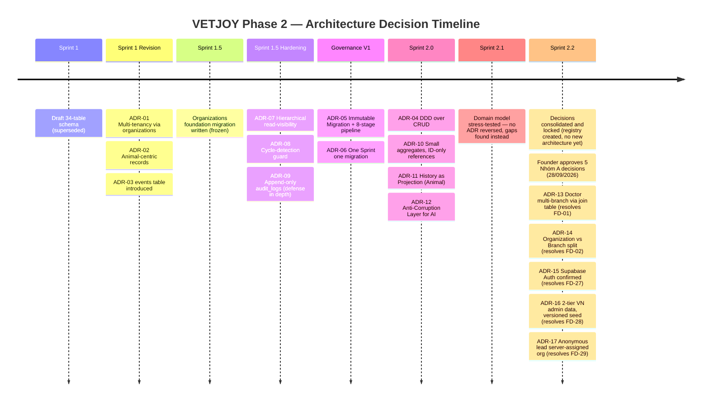

# 41. Architecture Decision Records (ADR)

> Unlike [`40_FOUNDER_DECISIONS_LOCK.md`](./40_FOUNDER_DECISIONS_LOCK.md)
> (decisions still **pending**), this document records decisions that
> are **already made and accepted** — a historical ADR log for Sprints 1
> through 2.1, written in the standard Context/Decision/Consequences
> shape so a future engineer understands *why*, not just *what*. Nothing
> here is new; this Sprint (2.2) only consolidates.

## ADR format

Each record: **Context** (the situation that forced a choice),
**Decision** (what was chosen), **Status** (Accepted / Superseded, with
what superseded it), **Consequences** (what this makes easier, what it
makes harder — every real decision has both).

---

### ADR-01. Multi-tenancy via `organizations`, not `dealer_id`

**Context**: Sprint 1's original design used `dealer_id` as an implicit
tenant/data-scoping mechanism. Founder identified this as conflating a
commercial relationship with a security boundary.
**Decision**: Introduce a dedicated, self-referencing `organizations`
table as the sole tenant boundary; `dealer_id` (later `Dealer`, Domain 5)
becomes a purely commercial relationship (BR-REL-03).
**Status**: Accepted (Sprint 1 Revision), reaffirmed at the Domain level
in Sprint 2.0.
**Consequences**: (+) clean separation of "who has commercial credit for
this sale" from "who can see this data"; (+) supports hierarchical
branches. (−) added one more foundational table and one more concept
(`organization_id`) every other table must carry.

### ADR-02. Animal-centric health records, not Customer-centric

**Context**: Original Sprint 1 draft implicitly organized medical data
around the `Customer`. Founder mandated the `Animal` be the center.
**Decision**: `animal_id` is required (NOT NULL) on `appointments`/
`treatments` and every Medical aggregate (BR-MED-01); `Customer` is
referenced only as current owner.
**Status**: Accepted (Sprint 1 Revision), elaborated as the model's Core
Domain in Sprint 2.0 (`32_ANIMAL_HEALTH_RECORD.md`).
**Consequences**: (+) matches VETJOY's actual differentiator claim
("không chỉ bán thuốc"); (+) supports ownership transfer without losing
medical history. (−) requires every Medical write path to resolve an
Animal first, even in flows that start from a Customer-facing screen.

### ADR-03. `events` table (Timeline) as the system-wide history mechanism

**Context**: Founder required a system-wide timeline in Sprint 1
Revision. Sprint 2.0 needed to decide how "History"/"Timeline" attaches
to Animal without unbounded aggregate growth.
**Decision**: One append-only `events` table backs a cross-cutting
Timeline; per-Animal (or per-Customer) history is always a *projection*
over this stream, never duplicated fields (`32_ANIMAL_HEALTH_RECORD.md`
§6; BR-TL-01/02/03).
**Status**: Accepted (Sprint 1 Revision for the table; Sprint 2.0 for the
projection principle).
**Consequences**: (+) single source of truth for "what happened";
(+) new "history" views (Owner History, Farm History, AI History) are
free once the event stream exists. (−) query/retention strategy at scale
is deferred, unsolved technical work (see `43_TECHNICAL_DEBT.md` TD-10).

### ADR-04. Domain-Driven Design over CRUD for the business/domain model

**Context**: Sprint 2.0's brief explicitly required DDD thinking ("Không
thiết kế theo CRUD. Thiết kế theo DDD.").
**Decision**: Model the CRM as 8 Bounded Contexts with explicit Aggregate
Roots, Value Objects, Domain Events, and Ubiquitous Language, rather than
a flat table-per-concept CRUD design.
**Status**: Accepted (Sprint 2.0), stress-tested in Sprint 2.1.
**Consequences**: (+) aggregate boundaries prevent accidental coupling
(e.g. `Prescription` independent of `Treatment`); (+) gives this whole
ADR/decision-tracking discipline something precise to reference. (−)
requires more upfront documentation/reasoning than a CRUD approach before
any code is written — the cost this Sprint 2.x series has been paying.

### ADR-05. Immutable Migration + 8-stage pipeline (Governance V1)

**Context**: After Sprint 1.5's Hardening review, Founder wanted a
permanent, repeatable discipline rather than one-off review effort per
migration.
**Decision**: An approved migration file is never edited again (Rule 1);
every database change passes Architecture → Review → Hardening →
Acceptance → Staging → Evidence → Founder Review → Production (Rule 2);
6 required artifacts per migration (Rule 3).
**Status**: Accepted (`21_GOVERNANCE.md`), currently governs all future
database work including whatever Sprint 3 becomes.
**Consequences**: (+) any Production schema state is fully reconstructable
and auditable from its migration history; (+) removes ambiguity about
what "done" means for a database change. (−) slower per-change velocity
than editing in place — an explicit, accepted tradeoff for a system
holding real animal-health and financial data.

### ADR-06. One Sprint = one migration, never merged

**Context**: Governance V1 needed a concrete boundary for what counts as
one unit of database change.
**Decision**: Each Sprint's database work ships as exactly one migration
file (splitting allowed only for hard technical ordering, per
`23_MIGRATION_POLICY.md` §5); Sprint boundaries are defined by
`BACKLOG_PHASE2.md`.
**Status**: Accepted (`21_GOVERNANCE.md` Rule 4/5).
**Consequences**: (+) each migration has a small, reviewable blast
radius; (+) rollback scope is always clear. (−) inter-Sprint dependencies
must be managed by migration *ordering* (timestamps), not by bundling —
requires discipline when a later Sprint needs an earlier Sprint's table.

### ADR-07. Hierarchical read-visibility, exact-match writes

**Context**: Sprint 1.5 Hardening required a real answer for "does an HQ
admin see branch data" without opening cross-tenant write access too
widely.
**Decision**: `visible_organization_ids()` grants read visibility to self
+ all descendant organizations for admin roles; every INSERT/UPDATE
policy still uses exact-match `current_organization_id()` only — reads
and writes intentionally use different scope functions.
**Status**: Accepted (Sprint 1.5 Hardening), carried forward unchanged
through Sprint 2.0/2.1.
**Consequences**: (+) HQ can monitor branches without being able to
silently edit branch data as themselves; (+) siblings never see each
other, by construction. (−) an HQ admin who legitimately needs to *edit*
branch data needs an explicit, separate elevation path not yet designed
(noted, not resolved, in Sprint 1.5's own Review Doc).

### ADR-08. Cycle-detection guard on organization hierarchy

**Context**: A self-referencing `parent_organization_id` can form a cycle
(A→B→C→A) that would break recursive visibility queries.
**Decision**: A `SECURITY DEFINER` trigger walks the proposed parent
chain upward before allowing an insert/update, rejecting any cycle, with
a 1000-hop safety valve.
**Status**: Accepted (Sprint 1.5 Hardening).
**Consequences**: (+) guarantees `visible_organization_ids()`'s recursive
CTE always terminates; (+) closes a real, then-undiscovered bug class
before Production. (−) adds a small write-path cost (a chain walk) on
every organization insert/update — accepted as negligible given
organizations are a low-frequency-write table.

### ADR-09. Append-only `audit_logs` via trigger + RLS + GRANT (defense in depth)

**Context**: An audit log that could be edited or deleted defeats its own
purpose, including against a compromised or over-privileged role.
**Decision**: Three independent layers all enforce immutability —
`prevent_audit_logs_mutation` trigger, RLS policies with no UPDATE/DELETE
grant, and table-level GRANT/REVOKE hardening (Sprint 1.5 Hardening
§6) — deliberately redundant rather than relying on any single
mechanism.
**Status**: Accepted (Sprint 1.5 Hardening), generalized as a business
principle to the whole event stream in Sprint 2.0 (BR-TL-01).
**Consequences**: (+) even a `service_role`-level mistake or a future RLS
bug doesn't silently make audit history mutable; (+) directly enables the
`events`/Timeline immutability guarantee ADR-03 depends on. (−) any
legitimate correction must be a new, additional record — never a fix-in-
place, which is the point but requires discipline in application logic
later.

### ADR-10. Small aggregates, ID-only cross-references

**Context**: Sprint 2.0 needed a discipline preventing the domain model
from becoming one large, tangled object graph.
**Decision**: Every Aggregate Root in `26_DOMAIN_MODEL.md`'s Aggregate
Design table references other aggregates by ID only, never by embedding
— e.g. `Prescription` is independent of `Treatment`, not a nested
collection inside it.
**Status**: Accepted (Sprint 2.0), validated (with one noted exception,
`AIConversation` — see `43_TECHNICAL_DEBT.md` TD-01) in Sprint 2.1.
**Consequences**: (+) each aggregate's lifecycle can evolve independently
without lock contention on unrelated concerns; (+) directly enables
BR-XD-01 (no domain reaches into another's aggregate). (−) requires more
explicit cross-aggregate event/lookup plumbing than a single denormalized
object would.

### ADR-11. History as Projection, not embedded field (Animal domain)

**Context**: The brief asked that every Animal have Identity, Health
Record, Timeline, Owner History, Farm History, and AI History — read
literally this suggests embedded growing fields on `Animal`.
**Decision**: Only Identity + current state live on the `Animal`
aggregate itself; the other five are computed projections over the
Domain Event stream (ADR-03), never stored as Animal fields
(BR-ANIM-04).
**Status**: Accepted (Sprint 2.0, `32_ANIMAL_HEALTH_RECORD.md` §6).
**Consequences**: (+) `Animal` stays small and low-write-contention no
matter how long its history grows; (+) the five "History" views are
consistent by construction (single source of truth). (−) any future
Sprint building these views needs an actual read-model/materialization
strategy — deferred as technical work (`43_TECHNICAL_DEBT.md` TD-07).

### ADR-12. Anti-Corruption Layer for AI (no auto-apply)

**Context**: The original Phase 1 brief's "AI không tự bịa" principle
needed a concrete Domain 6 mechanism, not just a policy statement.
**Decision**: Every AI output that could affect Medical/Commerce is
shaped as an `AIRecommendation` in `PendingReview` state; only an
explicit human "accept" event lets it become a real action (BR-AI-01,
enforced structurally per the Bounded Context Diagram's
Anti-Corruption-Layer relationship, `26_DOMAIN_MODEL.md`).
**Status**: Accepted (Sprint 2.0), stress-tested against future AI Vision
scenarios in Sprint 2.1 (`38_FUTURE_ARCHITECTURE.md`).
**Consequences**: (+) the single most important safety property in the
whole domain model has a concrete mechanism, not just a rule someone
could forget; (+) extends naturally to new AI input modalities (vision,
future). (−) every future AI capability must be designed to *propose*,
never *act* — a real constraint on how "smart"/"automatic" the product
can ever feel, by design.

### ADR-13. Doctor: một tài khoản đăng nhập, nhiều Branch qua bảng liên kết `doctor_branch_assignments`

**Context**: BR-REL-05 (Sprint 2.0) assumed a Doctor could work at more
than one organization. The frozen Sprint 1.5 migration only allows
`users.organization_id` to hold exactly one value per user — flagged as
a live contradiction in Sprint 2.1 (`34_DOMAIN_REVIEW.md` §2, FD-01).
**Decision**: A Doctor keeps exactly one login account
(`users` row, one `organization_id` = home/login organization —
unchanged in the frozen migration). Multi-branch work assignment is
modeled separately via a new many-to-many join table named
**`doctor_branch_assignments`** — a Doctor↔**Branch** link, not a
Doctor↔Organization link (Organization and Branch are distinct per
ADR-14) — introduced by a **new** migration in whichever future Sprint
builds `doctors`, not by editing the frozen migration. Minimum shape:

- `doctor_id` — references the Doctor; one Doctor may have **many** rows
  in this table (one per Branch they work at).
- `branch_id` — references the Branch the Doctor is assigned to.
- **Constraint**: the referenced Branch must belong to the **same
  Organization** as the Doctor's home account (`users.organization_id`).
  Assigning a Doctor to a Branch under a *different* Organization is
  never allowed. In Phase 2 (exactly one Organization, ADR-14) this
  constraint is trivially satisfied, but it must still be enforced
  explicitly — not assumed — so it holds if a second Organization is
  ever introduced.
- **RLS**: row-level security on this table (and on any Doctor-scoped
  data reached through it) must check Organization **by joining through
  Branch** (`branch.organization_id`), never by trusting `doctor_id`
  alone in isolation.

A Doctor's professional history, appointments, and audit log entries are
never split or duplicated per branch; they stay one unified record.
Because ADR-14 confirms Phase 2 has exactly one Organization (VETJOY),
"multi-branch" here means multiple Branches **within** that one
Organization, not a cross-tenant concern — this significantly simplifies
the RLS design this decision otherwise would have required.
**Status**: Accepted (Founder decision, 28/09/2026) — resolves the
FD-01 contradiction. Decision only; the `doctor_branch_assignments`
migration itself has not been written.
**Consequences**: (+) resolves the contradiction without touching the
frozen migration; (+) preserves one unified history per Doctor; (+) the
ADR-14 single-tenant scope removes the cross-tenant RLS complexity
originally feared; (+) naming the join table after Branch (not
Organization) keeps the Organization/Branch distinction consistent
everywhere it's used. (−) Sprint 2's `doctors` migration must now be
designed with this join table in mind from the start (or explicitly
schedule it as an immediate follow-up) — a new item for that Sprint's
own Architecture stage, not a retroactive change to anything already
approved.

### ADR-14. Organization = tenant, Branch = location — no longer synonymous

**Context**: Sprint 1 Revision through Sprint 2.1 used "organizations"
ambiguously for both "the company" and "its branches" — a question left
open since Sprint 1 Revision (`BACKLOG_PHASE2.md`) and never formally
closed (FD-02).
**Decision**: Two distinct concepts from now on — **Organization** (the
tenant/company that owns data; exactly one exists today: VETJOY) and
**Branch** (a location/chi nhánh belonging to an Organization). Naming
and architecture stay neutral (not hard-coded to "VETJOY") so a future
SaaS model remains possible, but Phase 2 builds and operates only the
single-Organization case. Phase 2 explicitly excludes: self-service
company sign-up, SaaS subscription billing, a multi-company admin UI,
and automatic tenant creation.
**Status**: Accepted (Founder decision, 28/09/2026) — resolves the FD-02
ambiguity, and as a side effect narrows FD-01 (ADR-13) and clarifies
BR-CUST-01's real scope (a Customer belonging to "exactly one
Organization" is trivially true today since only one Organization
exists — the actual, lower-stakes question is which *Branch*, governed
by FD-29/ADR-17).
**Consequences**: (+) removes a 3-Sprint-old ambiguity; (+) gives Sprint
2 a clear, narrow scope. (−) every existing document that used
"organization" to mean "branch" needs a terminology pass before Sprint
2's migrations lock this in permanently — tracked in
`45_RELEASE_ROADMAP.md`, not yet done.

### ADR-15. Supabase Auth is the single identity source

**Context**: the frozen Sprint 1.5 migration already extends
`auth.users`, but Founder confirmation was still formally outstanding
(FD-27) since Sprint 1 Revision.
**Decision**: Supabase Auth is confirmed as the one and only login
identity source for employees, doctors, dealers, and account-holding
customers, on web and on any future mobile app. No second authentication
system will be introduced.
**Status**: Accepted (Founder decision, 28/09/2026). No change to the
frozen migration — this decision matches exactly what was already built.
**Consequences**: (+) removes the last outstanding "implicit assumption"
flagged since Sprint 1 Revision; (+) unblocks `users`-dependent migration
work in Sprint 2. (−) ties the platform to the Supabase ecosystem for
authentication long-term — an accepted tradeoff, not revisited here.

### ADR-16. Official 2-tier Vietnamese administrative data, versioned seed

**Context**: `BACKLOG_PHASE2.md`'s Sprint 2 item and `12_SUPABASE_SCHEMA.md`'s
draft table names (`provinces`/`districts`/`communes`) assumed a 3-tier
model (tỉnh/huyện/xã). Vietnam's current administrative structure uses a
2-tier model (tỉnh/thành phố + xã/phường/đặc khu) — this mismatch was
surfaced only when FD-28 was decided.
**Decision**: Use the official, state-published administrative
directory, normalized into **versioned** seed data (source, effective
date, and import version recorded on the data itself). Model going
forward: tỉnh/thành phố → xã/phường/đặc khu → địa chỉ chi tiết. The old
"district" level becomes an optional/legacy field for historical data
only, never a required level for new data. No live third-party API
dependency at runtime.
**Status**: Accepted (Founder decision, 28/09/2026) — decision and plan
only; no data loaded, no seed created, no migration written (explicitly
out of scope for this task).
**Consequences**: (+) matches current administrative law rather than a
superseded model; (+) avoids a third-party runtime dependency. (−) every
existing document assuming the old 3-tier shape needs updating before
Sprint 2's reference-data migration is written — newly recorded as
technical debt (`43_TECHNICAL_DEBT.md`, to be added when that file is
next revised), not a surprise to whoever writes that migration.

### ADR-17. Anonymous website leads: server-assigned Organization, branch allocation queue

**Context**: no mechanism existed for assigning `organization_id` to a
lead submitted by an anonymous website visitor (`13_RLS_POLICY_PLAN.md`'s
"Ghi chú triển khai" section named this as an open question) — blocking
the `customers` migration and lead-conversion service planned for
BACKLOG Sprint 2 (FD-29).
**Decision**: every public, anonymous lead is assigned to the VETJOY
**Organization** (not a specific Branch) by the server/RPC layer —
never trusted from client input. New leads enter a central allocation
queue; `branch_id` may stay empty until staff assign it, or default to
headquarters if the schema requires a non-null value. Branch allocation
never changes which Organization owns the data. Lead source, submission
timestamp, and allocation status must always be retained. A
geography-based allocation rule may be added later, via its own decision
and migration, once at least two branches are genuinely active.
**Status**: Accepted (Founder decision, 28/09/2026) — decision and plan
only; no migration or RPC written yet.
**Consequences**: (+) unblocks the `customers` migration and
lead-conversion service design in Sprint 2; (+) closes an
anonymous-input trust gap before any code is written. (−) the future
migration/RPC design must explicitly enforce "never trust
client-submitted `organization_id`/`branch_id`" as a Hardening-stage
check, not just an Architecture-stage assumption.

---

## Architecture Decision Timeline

## File liên quan

- Decisions registry, including the 28/09/2026 approvals behind ADR-13…17: [`40_FOUNDER_DECISIONS_LOCK.md`](./40_FOUNDER_DECISIONS_LOCK.md)
- Where these decisions came from: `11_DATABASE_ARCHITECTURE.md`, `16_ORGANIZATIONS_MIGRATION_REVIEW.md`, `21_GOVERNANCE.md`, `26_DOMAIN_MODEL.md`, `BACKLOG_PHASE2.md`
- Findings that stress-tested these decisions: [`34_DOMAIN_REVIEW.md`](./34_DOMAIN_REVIEW.md)
- Unresolved technical follow-ups from these decisions: [`43_TECHNICAL_DEBT.md`](./43_TECHNICAL_DEBT.md) (ADR-13/16 follow-ups not yet added there — see report)
- Sprint-gating consequence of ADR-13…17: [`45_RELEASE_ROADMAP.md`](./45_RELEASE_ROADMAP.md)
