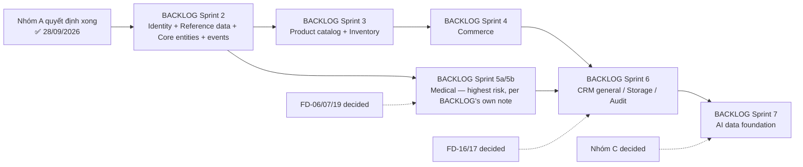

# 45. Release Roadmap (post-lock)

> Sequences what can happen next now that
> [`40_FOUNDER_DECISIONS_LOCK.md`](./40_FOUNDER_DECISIONS_LOCK.md)
> exists. Introduces no new Sprint content — only sequences and gates
> what `BACKLOG_PHASE2.md` already defined, against what
> `40_FOUNDER_DECISIONS_LOCK.md` still has Pending.

## First, resolving a naming collision

Two numbering tracks have been running in parallel across this project
and they mean different things:

- **Session/Sprint-track numbering** (used throughout this conversation):
  Sprint 1 → Sprint 1 Revision → Sprint 1.5 → Sprint 1.5 Hardening →
  Governance V1 → Sprint 2.0 → Sprint 2.1 → Sprint 2.2. Each of these is
  a **business-analysis or governance milestone**, not necessarily a
  single migration.
- **`BACKLOG_PHASE2.md`'s own Sprint numbering**: Sprint 1.5
  (organizations foundation, ✅ done) → Sprint 2 (identity/reference
  data/core entities/events) → Sprint 3 (product catalog/inventory) →
  Sprint 4 (commerce) → Sprint 5a/5b (medical/care) → Sprint 6 (CRM
  general/storage/notifications/audit) → Sprint 7 (AI data foundation).
  Each of these **is** meant to become exactly one migration file, per
  Governance Rule 5.

**When this Sprint's own brief and report questions say "Sprint 3,"
they mean the next milestone in the session-track** — which, concretely,
is the Architecture stage (Governance's 8-stage pipeline, Stage 1) for
`BACKLOG_PHASE2.md`'s own **Sprint 2**. This document uses
"BACKLOG Sprint N" from here on to stay unambiguous.

## What gates BACKLOG Sprint 2

BACKLOG Sprint 2 covers: `roles`/`permissions`/`user_roles`/
`role_permissions`, `provinces`/`districts`/`communes`,
`species`/`breeds`, `ai_prompt_templates`, `users` (+ `organization_id` +
auth sync), `doctors`/`employees`/`dealers`, `customers` (+ lead→customer
conversion service), `farms`/`animals`, `events` (table structure only),
plus real RLS for these.

| Founder decision (from `40`) | Why it gates BACKLOG Sprint 2 | Status |
| --- | --- | --- |
| FD-27 (Supabase Auth confirmation) | `users` migration's whole shape depends on this | ✅ Decided 28/09/2026 — Supabase Auth confirmed, no change to frozen migration |
| FD-28 (VN admin geo data source) | `provinces`/`districts`/`communes` seed data can't be written without it | ✅ Decided 28/09/2026 — official data, **but model changes from 3 tiers to 2 tiers** (see below) |
| FD-29 (org_id for anonymous requests) | The `customers` migration's lead→customer conversion service must assign `organization_id` correctly | ✅ Decided 28/09/2026 — server-assigned to VETJOY Organization + central allocation queue, with explicit security requirements (see `40`) |
| FD-01 (Doctor multi-branch) | `doctors` migration's relationship to `users`/Branch depends on this | ✅ Decided 28/09/2026 — one login per Doctor; multi-**Branch** (same Organization only) via new join table `doctor_branch_assignments` |
| FD-02 (organizations model: branches vs. SaaS) | Shapes `customers`/`organizations` UX assumptions baked into this Sprint's services | ✅ Decided 28/09/2026 — single Organization (VETJOY) for now; Organization ≠ Branch from now on |

**All five Nhóm A decisions are now Decided (28/09/2026)** — the gate
that previously blocked BACKLOG Sprint 2 is clear. See "Trạng thái sau
28/09/2026" below for what still needs attention *within* Sprint 2's own
Architecture stage before migration SQL is written — the gate being
clear is not the same as `BACKLOG_PHASE2.md`'s own wording already
reflecting these decisions.

## Trạng thái sau 28/09/2026: gate rõ, nhưng nội dung Sprint 2 cần cập nhật trước khi viết SQL

Founder đã phê duyệt cả 5 quyết định Nhóm A. Điều này có nghĩa:

### Founder Decision Gate: **PASS**

- Cả 5 quyết định Nhóm A (FD-01, FD-02, FD-27, FD-28, FD-29) đã
  **Decided** — điều kiện gate của Điều khoản khoá trong `40` đã thoả.
- **Được phép mở giai đoạn Kiến trúc (Architecture, Stage 1 của
  `21_GOVERNANCE.md`) của BACKLOG Sprint 2.**
- **Chưa được viết migration hoặc source code cho Sprint 2** cho tới
  khi: (1) các tài liệu bị ảnh hưởng (bảng dưới, cộng danh sách trong
  báo cáo Sprint 2.2 gửi Founder) được đồng bộ với 5 quyết định này, và
  (2) Founder duyệt bản đồng bộ đó. Đây là hai điều kiện **riêng biệt**
  với việc khoá 5 quyết định — khoá quyết định không tự động thoả hai
  điều kiện này.
- **Chưa có Sprint phát triển nào được tự khởi động** trong nhiệm vụ
  này.

Ba quyết định (FD-01, FD-28, FD-29) đưa ra nội dung **cụ thể hơn** những
gì `BACKLOG_PHASE2.md` hiện đang mô tả cho Sprint 2, nên giai đoạn Kiến
trúc của Sprint 2 — khi thực sự bắt đầu — cần đối chiếu và cập nhật các
điểm sau trước khi viết migration thật:

| Việc cần đối chiếu khi Sprint 2 bắt đầu | Vì sao |
| --- | --- |
| Đổi mô hình `provinces`/`districts`/`communes` (3 cấp) sang mô hình 2 cấp (tỉnh/thành phố + xã/phường/đặc khu) | ADR-16 (`41`) — mô hình hành chính đã đổi |
| Thiết kế `doctors` migration có kèm bảng liên kết nhiều-nhiều `doctor_branch_assignments` (`doctor_id`, `branch_id`, ràng buộc Branch phải cùng Organization với tài khoản gốc, RLS kiểm tra Organization qua Branch) — hoặc lên lịch làm ngay sau | ADR-13 (`41`) |
| Dịch vụ chuyển đổi `leads` → `customers` phải gán `organization_id` ở phía server, không tin dữ liệu client gửi lên, và đưa lead vào hàng chờ trung tâm | ADR-17 (`41`) |
| Thống nhất thuật ngữ Organization (tenant) vs. Branch (chi nhánh) trong toàn bộ tài liệu Sprint 2 sẽ tham chiếu | ADR-14 (`41`) |

Danh sách tài liệu cụ thể cần cập nhật theo các điểm trên (chưa sửa
trong nhiệm vụ này) nằm trong báo cáo Sprint 2.2 gửi Founder, không lặp
lại ở đây.

## What does NOT need to wait

Nhóm B and Nhóm C decisions (`40`) do not block BACKLOG Sprint 2 —
they're gated against their own, later Sprint:

| Nhóm B/C decision | Gates (not BACKLOG Sprint 2) |
| --- | --- |
| FD-06, FD-07, FD-19 (withdrawal period, disease reporting, production tracking) | BACKLOG Sprint 5a/5b (Medical) |
| FD-16, FD-17 (automatic reminders, campaigns) | BACKLOG Sprint 5b (reminders) / Sprint 6 (notifications) |
| FD-04, FD-05 (license verification, collections policy) | Can be decided any time before BACKLOG Sprint 5a (Doctor onboarding) / Sprint 4 (Commerce) respectively — process decisions, not schema-blocking |
| FD-08 (data deletion/export) | Should land before real Customer data volume grows — not schema-blocking for Sprint 2 itself, but shouldn't be delayed indefinitely |
| FD-09–FD-12, FD-24–FD-26, FD-35, FD-36 (Nhóm C) | BACKLOG Sprint 7 (AI) or later phases entirely |
| FD-30–FD-34 (infra: budget, CMS, hosting, analytics, job runner) | Operational tracks independent of the migration Sprint sequence — can proceed in parallel |

## Suggested sequence once Nhóm A is decided

This mirrors `BACKLOG_PHASE2.md`'s and `15_PHASE2_ROADMAP.md`'s own
already-established dependency order (Identity/Reference data first,
because every later Sprint's tables reference `organizations`/`users`/
`species`/`animals`) — this document adds only the Founder-decision
gating on top, it does not reorder anything `BACKLOG_PHASE2.md` already
decided.

## What this Sprint (2.2) changes about how future Sprints work

Per the Lock Clause in `40_FOUNDER_DECISIONS_LOCK.md`: from this point,
whoever runs BACKLOG Sprint 2's Architecture stage does not re-litigate
FD-01/02/27/28/29 — they build according to what's now marked Decided.
This is the concrete meaning of "khoá" (lock) for release planning
purposes. As of 28/09/2026 this is no longer hypothetical: all five are
Decided, so this rule is already in effect for BACKLOG Sprint 2.

**Điều chưa xảy ra**: phê duyệt 5 quyết định này không tự động "mở"
BACKLOG Sprint 2 — nó chỉ gỡ điều kiện chặn. Việc chỉ thị bắt đầu giai
đoạn Kiến trúc thật sự (viết migration SQL đầu tiên của Sprint 2) vẫn là
một hành động riêng, cần Founder yêu cầu rõ ràng ở một nhiệm vụ khác.

## File liên quan

- Decisions gating this roadmap: [`40_FOUNDER_DECISIONS_LOCK.md`](./40_FOUNDER_DECISIONS_LOCK.md)
- Architecture consequences of the 28/09/2026 approvals (ADR-13…17): [`41_ARCHITECTURE_DECISIONS.md`](./41_ARCHITECTURE_DECISIONS.md)
- Underlying Sprint/migration content (not yet updated to match ADR-13/14/16/17): [`BACKLOG_PHASE2.md`](./BACKLOG_PHASE2.md)
- Technical dependency order this roadmap doesn't change: [`15_PHASE2_ROADMAP.md`](./15_PHASE2_ROADMAP.md)
- Pipeline every one of these Sprints must still follow: [`21_GOVERNANCE.md`](./21_GOVERNANCE.md)
